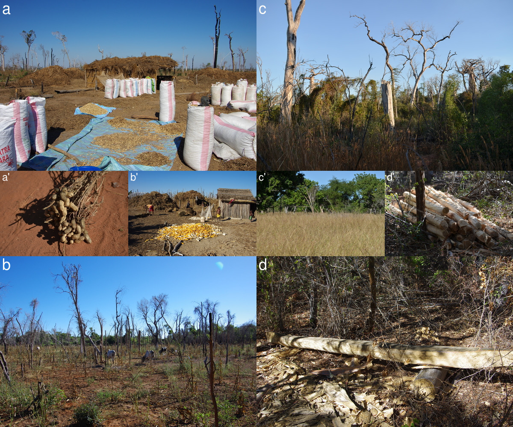
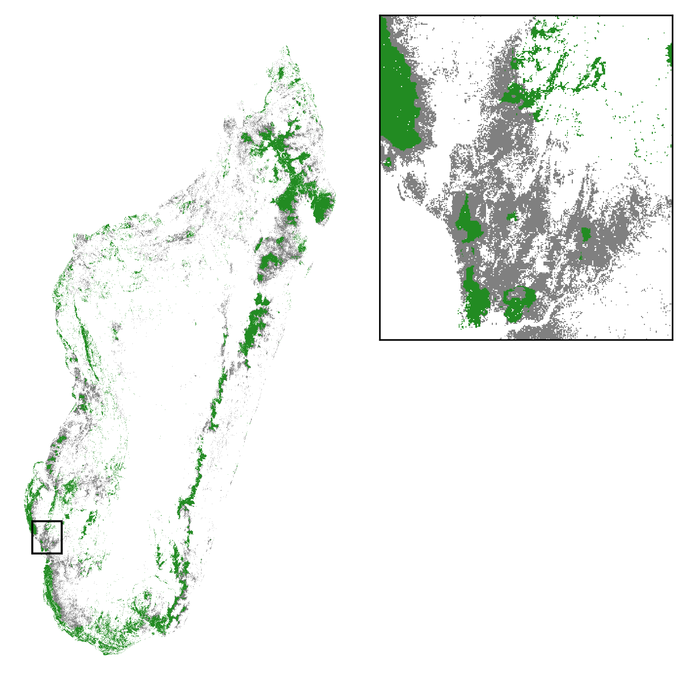
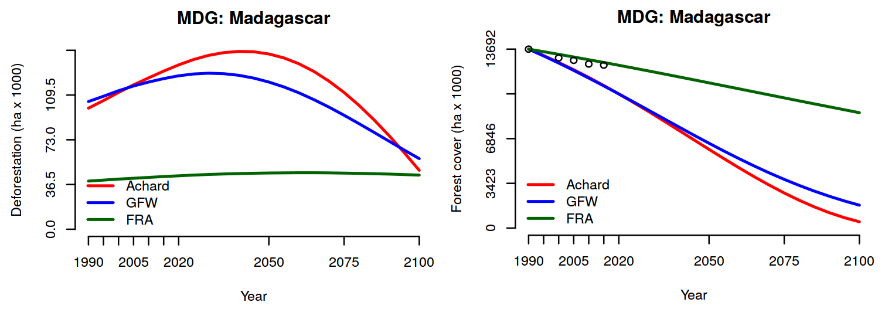

# 4. Rapport d'activités et productions scientifiques 

## _Description générale des activités et résultats_

```{r comment4, echo=FALSE}
# Décrivez le déroulement du projet, ses principaux résultats, et leur importance pour ce domaine de recherche en précisant la contribution de chacune des équipes participantes. Merci d'insérer quelques figures clés et de fournir les graphiques originaux séparément. Environ 8 à 10 pages.
```

### Contexte et enjeu

L'île de Madagascar s'est séparée du continent africain il y a environ 165 millions d'années, et de l'Inde il y a 88 millions d'années [@Ali2008]. Cette île continent a été colonisée par les humains il y a seulement 2300 ans environ [@Burney2004; @Cox2012; @Tofanelli2009]. La flore et la faune de Madagascar ont évolué de faço isolée. Ceci a contribué à l'émergence d'une biodiversité exceptionnelle à Madagascar et d'un fort taux d'endémisme dans de nombreux groupes taxonomiques [@Crottini2012; @Goodman2005]. Madagascar contient ainsi 5% de la biodiversité mondiale connue sur seulement 0,4% des terres émergées dans le monde. Il a quatre fois plus d'espèces de palmiers que dans toute l'Afrique [@Dransfield1995]. Un quart des espèces de plantes vasculaires existent à Madagascar pour un cinquantième de la superficie des terres par rapport à l'Afrique [@Schatz1996]. De même, plus de la moitié des caméléons du monde sont présents à Madagascar. L'endémisme au niveau de la famille et du genre taxonomique est également élevé. Chez les amphibiens, 23 des 24 genres existants, et une famille sur quatre est endémique de Madagascar [@Vieites2009]. Plus de 83% des plantes vasculaires [@Schatz2000] et jusqu'à 86% des invertébrés sont endémiques de l'île [@Goodman2005]. A Madagascar la diversité phylogénétique des vertébrés est plus élevée que dans toute l'Amérique centrale et du Sud [@Holt2013]. La biodiversité terrestre de Madagascar est principalement concentrée dans les forêts [@Hannah2008] qui incluent plusieurs types de végétation ligneuse tels que les forêts humides de l'Est et du Nord, les forêts sèches épineuses du Sud et les forêts sèches décidues à l'Ouest [@Vieilledent2016].

La biodiversité malgache est sévèrement menacée par le changement climatique [@Hannah2008] et la déforestation [@Allnutt2008; @Harper2007; @Vieilledent2013]. Plusieurs études ont mis en évidence le risque de perte de biodiversité due au changement climatique à Madagascar. De nombreuses espèces malgaches, par exemple les reptiles, ont des niches climatiques étroites et sont particulièrement vulnérables. Dans une étude portant sur 30 espèces de reptiles et d'amphibiens dans le massif le plus élevé de Madagascar, @Raxworthy2008 ont montré un déplacement en altitude des espèces de 19 à 51 m entre 1993 et 2003 qui est associé au réchauffement climatique local. Le déplacement vers le haut de la pente peut potentiellement entraîner l'extinction des espèces actuellement présentes aux plus hautes altitudes. De plus, plusieurs auteurs ont prédit une perte d'habitat importante sous l'effet du changement climatique tant pour les espèces animales (voir
@Andriamasimanana2013 pour le cas de neuf espèces d'oiseaux malgaches) que végétales [@Hannah2008; @Vieilledent2013a], et qui pourraient
conduire à l'extinction des espèces (voir l'exemple de l'espèce de baobab _Adansonia suarezensis_ dans l'article de @Vieilledent2013a).
Alors que la biodiversité terrestre de Madagascar est principalement concentrée dans les forêts, les études par télédétection et analyse d'images satellites révèlent que seulement 10 à 15% de la forêt originelle subsiste à Madagascar et que la déforestation se poursuit à un rythme d'environ 1% par an [@Achard2002; @Harper2007; @Vieilledent2013]. Pendant ce temps, la population humaine a plus que triplé depuis 1950 et continue de croître à un rythme proche de 3% par an [@Raftery2012; @Vieilledent2013]. À Madagascar, les moyens de subsistance des populations dépendent dans une large mesure des ressources forestières. Certaines études indiquent que le capital naturel du pays représente 49% de la richesse totale du pays [@WorldBank2013]. @Vieilledent2013 ont récemment souligné le lien entre démographie et intensité de la déforestation à Madagascar et le risque d'une augmentation de la vitesse de la déforestation à court terme
liée à l'explosion démographique. De plus, plusieurs indices de développement placent couramment Madagascar autour du dixième rang des pays les plus pauvres, ce qui induit un risque fort de pression sur les forêts naturelles restantes. En raison à la fois des niveaux élevés de diversité et d'endémisme sur l'île et du déclin rapide des habitats naturels, Madagascar est universellement reconnue comme une priorité mondiale pour la conservation de la biodiversité [@Brooks2006; @Myers2000].

Pour éviter la déforestation et atténuer les changements climatiques, Madagascar est en train de mettre en place le programme national REDD+ de Réduction des Emissions liées à la Déforestation et à la Dégradation des forêts. Plusieurs projets pilotes REDD+ ont été développés à Madagascar, principalement dans la forêt tropicale humide de la côte Est (voir par exemple le PHCF, "Programme Holistique de Conservation des Forêts", présenté dans @Vieilledent2013). Bien que le programme REDD+ soit principalement axé sur les émissions de carbone, le programme REDD+ national et les projets locaux devront intégrer des co-bénéfices pour la biodiversité. Pour le moment, peu d'information et d'outils sont disponibles pour évaluer l'impact des projets REDD+ en terme de conservation de la biodiversité.

Pour préserver la biodiversité malgache, un travail remarquable a été réalisé depuis le cinquième congrès mondial sur les parcs de l'UICN (Union Internationale pour la Conservation de la Nature) tenu à Durban en 2003, afin de concevoir un réseau d'aires protégées intégrant les points chauds de biodiversité et les aires protégées existant à l'époque au niveau national [@Kremen2008]. Actuellement, il existe plus de 50 aires protégées à Madagascar divisées entre les réserves naturelles intégrales (catégorie I de l'UICN), les parcs nationaux (catégorie II de l'UICN) et les réserves spéciales (catégorie IV de l'UICN) [@Rabearivony2010]. Parmi ces aires protégées, beaucoup sont dans un statut temporaire ou en cours de création [@Rabearivony2010]. Le futur réseau d'aires protégées à Madagascar (SAPM, Système d'Aires Protégées à Madagascar) devrait couvrir plus de 10% du territoire nationale et intégrer une bonne partie des forêts naturelles subsitant à Madagascar. Dans le contexte d'un changement climatique anthropique rapide [@IPCC2007; @Loarie2009], il est très probable que de nombreuses espèces ne soient pas en mesure de s'adapter ni de coloniser de nouveaux habitats favorables d'un point de vue climatique [@Menendez2006]. Ceci s'explique en partie par une faible dispersion des espèces, rendue difficile par la disparition des animaux disperseurs [@Menendez2006; @Vieilledent2013a] et une perte d'habitat (associé à la déforestation) en dehors des aires protégées actuelles [@Vieilledent2013a]. Ainsi, les espèces devraient connaitre une contraction de leur aire de distribution actuelle [@Andriamasimanana2013; @Hannah2008; @Raxworthy2008; @Vieilledent2013a]. Par conséquence, la majeure partie de la biodiversité devrait se concentrer dans des zones refuge à l'intérieur des aires protégées. Identifier ces zones refuge est particulièrement important afin d'orienter les efforts de conservation sur des sites pertinents.

### Objectifs

L'objectif du projet BioSceneMada est de développer des scénarios d'évolution de la biodiversité sous l'effet conjoint de la déforestation et du changement climatique (Fig. \@ref(fig:schema)). On se propose premièrement d'établir des scénarios de déforestation et d'estimer la perte de biodiversité associée à cette déforestation. Les scénarios de déforestation s'appuieront sur les taux de déforestation historiques, qui seront à estimer, ainsi que sur la croissance démographique et sur le lien qui existe potentiellement entre population et déforestation. Ce lien sera à mettre en évidence et à estimer quantitativement. Les scénarios de croissance démographique ne seront pas à établir mais seront issus de la littérature. Deuxièmement, l'objectif est d'estimer l'impact des changements climatiques sur la perte de biodiversité à Madagascar. Il faudra donc dans un premier temps établir une base de données représentative de la biodiversité à Madagascar. L'impact sur la biodiversité sera considéré sous l'angle des espèces (risque d'extinction des espèces via la contraction des aires de distribution, ex. les espèces de baobabs) mais également sous l'angle des communautés (perte d'habitat ou restriction des habitats pour les communautés, ex. la forêt tropicales humides de montagne). Les scénarios climatiques du GIECC (Groupe International d'Experts sur les Changements Climatiques) seront utilisés. Troisièmement, l'objectif du projet est d'identifier les futurs points-chauds ("hotspots") de biodiversité à fort risque de déforestation.

L'ensemble de ces scénarios sera spatialisé et les résultats seront principalement rendus sous forme de cartes. Les scénarios permettront notamment de proposer des stratégies d'aménagement du territoire les plus efficaces possibles en vue de la conservation de la biodiversité et s'apppuyant sur des résultats issus de la recherche scientifique. Par exemple, les efforts de conservation pourraient être concentrés soit sur les zones refuges de la biodiversité sous contrainte climatique, soit au contraire sur des zones importantes pour la conservation de la biodiversité mais qui risquent de disparaitre à cause de la déforestation.

(ref:cap-schema) **Description schématique du projet.** Les modèles combinent des données d'inventaires, des données environnementales et des données démographiques pour évaluer l'impact futur des changements climatiques et de la déforestation sur la biodiversité à Madagascar. Les résultats sont utilisés pour une aide à la décision en aménagement du territoire et pour définir des stratégies de conservation efficaces.

```{r schema, out.width="\\textwidth", fig.cap="(ref:cap-schema)"}
knitr::include_graphics("figures/Scheme.png")
```

### Développement de modèles et scénarios de la biodiversité

#### Modélisation de l'intensité de la déforestation


#### Modélisation spatialisée de la déforestation

#### Modélisation de la niche climatique des espèces

#### Modélisation de l'assemblage des espèces en communauté

### Principaux résultats

#### MadaClim: portail de données climatiques et environnementales à Madagascar

Dans le cadre du projet BioSceneMada, nous avons développé le site internet MadaClim (<https://madaclim.cirad.fr>). Ce site reprend toutes les données climatiques actuelles fournies par WorldClim ainsi que les prédictions climatiques issues des modèles du GIEC (groupe d'experts intergouvernemental sur l'évolution du climat) et fournies par le CGIAR CCAFS. Les données sont recompilées (reprojetées et rééchantillonnées à 1km) et distribuées spécifiquement pour Madagascar. Des variables bioclimatiques supplémentaires comme l'évapotranspiration et le nombre de mois secs ont été calculées et ajoutées aux variables déjà disponibles. En plus des données climatiques, des données environnementales (sol, géologie, altitude, etc.) sont également fournies. Ce site et ces données sont particulièrement utiles pour tous les chercheurs, gestionnaires, membres d'ONG environnementales, ministères voulant étudier les effets du changement climatique à Madagascar. Elles peuvent être utilisées par exemple pour calculer les anomalies climatiques prédites par les modèles du GIECC (Fig. \@ref(fig:anomalies)).

(ref:cap-pet) **Exemple de variable bioclimatique calculée: evapotranspiration potentielle (ETP) mensuelle actuelle pour Madagascar (mm).** Nous avons utilisé l'équation de Thornthwaite qui permet de calculer l'ETP à partir des températures moyennes mensuelles et de la durée moyenne du jour sur le mois.

```{r pet, out.width="13cm", fig.cap="(ref:cap-pet)"}
# knitr::include_graphics("figures/pet.png")
```

(ref:cap-anomalies) **Anomalies climatiques prédites sur les forêts de Madagascar entre 2010 et 2080.** Les anomalies ont été calculées pour les précipitations annuelles (panneau de gauche), la saisonnalité de la température (milieu) et la température moyenne annuelle (droite) en faisant la moyenne des prédictions de sept modèles climatiques du GIEC suivant le scénario d'émission RCP 8.5. Les précipitations devraient diminuer, notamment sur les forêts humides de l'est et la saisonnalité de la température ainsi que la température moyenne annuelle devraient augmenter sur l'ensemble des forêts de Madagascar.

```{r anomalies, out.width="\\textwidth", fig.cap="(ref:cap-anomalies)"}
knitr::include_graphics("figures/Anomalies.png")
```

#### Carte de carbone forestier et vulnérabilité des forêts tropicales au changement climatique à Madagascar

Dans le cadre du projet BioSceneMada, en utilisant les données climatiques précédemment calculées (<https://madaclim.cirad.fr>) et des données d'inventaires forestiers pour 1771 placettes réparties sur l'ensemble de Madagascar, nous avons démontré qu'il existait un lien fort entre climat et stocks de carbone forestiers. Ce lien est notamment déterminé par les caractéristiques architecturales (hauteur notamment) des espèces d'arbres présentes le long du gradient climatique à Madagascar (climat --> assemblage d'espèces --> stocks de carbone). Ainsi, les stocks de carbone sont en moyenne beaucoup plus faibles en forêt épineuse (17 Mg.ha$^{-1}$) qu'en forêt humide (150 Mg.ha$^{-1}$). Le modèle statistique intégrant la relation climat-stock de carbone a permis de produire une carte précise des stocks de carbone forestier à Madagascar à une résolution de 250 m. Cette carte pourra être utilisée par les instances gouvernementales à Madagascar ou les porteurs de projet REDD+ au niveau régional pour le calcul des émissions de CO2 associées à la déforestation. Cette carte ainsi que les données qui ont permis de l'obtenir sont disponibles sur le site du projet BioSceneMada (<https://bioscenemada.cirad.fr/carbonmaps>) ainsi que sur le serveur de données Dryad (doi: [10.5061/dryad.9ph68](http://doi.org/10.5061/dryad.9ph68)).

Concernant les scénarios d'évolution de la biodiversité et des stocks de carbone forestier, nous avons montré à l'aide de ce modèle que les changements climatiques devraient induire des modifications fortes des communautés forestières et en conséquence une diminution de -17% (7-24%) des stocks de carbone forestier à Madagascar à l'horizon 2100 par rapport à 2010 (Fig. \@ref(fig:carbonmaps)). Ces changements seront vraisemblablement plus forts pour la forêt humide de l'est (notamment autour de la péninsule de Masoala-Makira) que pour les forêts sèches et épineuses de l'ouest et du sud. En comparaison, un taux de déforestation constant de 0.5% par an conduirait à une perte de carbone forestier de l'ordre de 29% entre 2010 et 2100. L'impact potentiel des changements climatiques sur les émissions de CO2 n'est donc pas à négliger.

(ref:cap-carbonmaps) **Carte de carbone forestier et évolution potentielle des stocks sous l'effet du changement climatique.** Les changements climatiques devraient induire des modifications fortes des communautés forestières et en conséquence une diminution des stocks de carbone forestier (-17% en 2100 par rapport à 2010).

```{r carbonmaps, out.width="\\textwidth", fig.cap="(ref:cap-carbonmaps)"}
knitr::include_graphics("figures/carbonmaps.png")
```

#### Base de données de biodiversité à Madagascar

Nous avons construit un jeu de données sur la biodiversité à Madagascar regroupant 300 000 observations (points de présence) pour 4969 espèces. Ces espèces sont réparties dans différents groupes taxonomiques (Plantes, Vertébrés, Invertébrés) et sont représentatives de la biodiversité à Madagascar (Tab. 2). Nous avons apporté une attention particulière à la qualité des données. Toutes les données ont été vérifiées du point de vue des coordonnées géographiques (issues de relevés GPS) et de la taxonomie. Pour la vérification de la taxonomie, nous nous sommes appuyés sur le package `taxize` disponible sous le logiciel `R`. Ce travail de compilation de données de biodiversité est sans précédent à Madagascar. Les précédentes études scientifiques sur la biodiversité à l'échelle nationale à Madagascar s'appuyait sur un nombre d'espèces < 2843 [@Allnutt2008; @Kremen2008]. Plusieurs institutions ont accepté de partager leur données de biodiversité dans le cadre du projet BioSceneMada et ont ainsi largement contribué à la réalisation de cette base de données. Ces données sont souvent issues d'un travail de prospection conséquent qui s'étalent sur plusieurs dizaines d'années.

```{r species, results="asis", echo=FALSE}
library(pander)
df.species <- read.table("tables/species.txt", header=TRUE, sep=";")
names(df.species)[1] <- " "
pandoc.table(df.species, justify=c("left","left","right","right","right"),
             split.table=Inf)
```

Table 2: **Bases de données sur la biodiversité de Madagascar.** La base de données incluent des points de présence pour 4969 espèces réparties dans différents groupes taxonomiques. Ces espèces sont représentatives de la biodiversité à Madagascar.

#### Atlas de la biodiversité à Madagascar et de sa vulnérabilité au changement climatique

Nous avons développé un script permettant de modéliser la niche climatique des espèces à partir de modèles d'ensemble [@Vieilledent2013a;@Araujo2007a]. Ce script utilise le package `biomod2` sous `R`. A partir de variables environnementales, incluant des variables climatiques (température moyenne annuelle, saisonnalité de la température, précipitations annuelles, déficit en eau, nombre de mois secs) et des variables physiques (radiation solaire, géologie) disponibles sur le site [MadaClim](https://madaclim.cirad.fr), il permet de prédire la probabilité de présence ainsi que l'aire de distribution présente et future des espèces à Madagascar. Les prédictions sont issues de plusieurs modèles statistiques (Maxent, GLM, GAM et Random Forest). L'approche par modèles d'ensemble permet de moyenner les prédictions faites par plusieurs modèles statistiques afin d'évaluer l'incertitude des prédictions et d'augmenter la robustesse de l'aire de distribution. Le script a été développé au cours du stage de Master II de Mario Muniz-Tagliari. L'idée est de pouvoir utiliser ce script et modéliser l'aire de distribution présente et future de l'ensemble des espèces constituant le jeu de données sur la biodiversité à Madagascar (4969 espèces). 

Le script a été optimisé. Il peut être parrallélisé, c'est-à-dire envoyé sur les différents processeurs d'un serveur afin d'accélérer les calculs. Il permet également de créer un document pdf dynamique, réactualisable très facilement, où les photos, textes, figures et tableaux sont agencés de manière automatique pour chaque espèce (Fig. \@ref(fig:atlas)). La dernière version du script est disponible sur GitHub: <https://github.com/ghislainv/atlas>. Ce répertoire est privé pour le moment mais accessible avec le couple d'identifiants suivant sur la plateforme GitHub: `gvguest`/`gvguest!1`. L'objectif est d'obtenir au final un atlas de la biodiversité à Madagascar incluant (i) les points de présence des espèces, (ii) leur aire de distribution actuelle, (iii) la distribution future potentielle des espèces sous l'effet du changement climatique et une estimation de leur vulnérabilité au changement climatique.

Un prototype de cet atlas a été réalisé pour les 7 espèces de baobab présentes à Madagascar. Le prototype de l'atlas est disponible [ici](https://bioscenemada.cirad.fr/FileTransfer/atlas.pdf).

(ref:cap-atlas) **Extrait de l'atlas de la biodiversité à Madagascar et de sa vulnérabilité au changement climatique pour l'espèce _Adansonia grandidieri_.** Une fiche est dynamiquement créée à parti du nom taxonomique de l'espèce et de ses points de présence en utilisant un script `R`. Photo et texte sont extraits automatiquement du site _Encyclopedia Of Life_ (http://eol.org). Un ensemble de modèles statistiques est utilisé pour prédire la niche climatique et l'aire de distribution actuelle de l'espèce. Ce modèle d'ensemble est ensuite utilisé pour prédire la vulnérabilité de l'espèce au changement climatique en intégrant les prédictions climatiques du GIECC suivant deux scénarios, RCP 8.5 et 4.5.

```{r atlas, out.width="80%", fig.cap="(ref:cap-atlas)"}
knitr::include_graphics("figures/atlas.png")
```

#### Cartes de biodiversité et des communautés d'espèces à Madagascar

Lorsque l'on parle de carte de biodiversité à l'échelle nationale, l'objectif n'est pas uniquement d'obtenir des informations sur la localisation des "hotspots" ou points-chauds de la biodiversité (les sites ayant une diversité spécifique élevée), ce que l'on appelle la diversité $\alpha$. Il est en effet surtout intéressant de considérer la diversité $\beta$, c'est-à-dire les communautés ou assemblages d'espèces et comment les assemblages d'espèces changent spatialement ("species turnover"), selon des gradients environnementaux (d'altitude, de climat, etc.). De telles cartes n'existent pas actuellement à l'échelle nationale pour Madagascar. Seules des cartes de végétation sont disponibles pour lesquelles la classification s'appuie sur la définition de grands biomes (<http://www.vegmad.org>) et non sur des relevés à l'échelle de l'espèce, à la fois pour la faune et la flore.

En utilisant des modèles de communautés [@Ferrier2007], nous avons cherché à identifier les facteurs environnementaux déterminants les assemblages d'espèces. Ces facteurs peuvent être climatiques ou associés à des barrières géographiques comme les bassins versants ou les rivières [@Pearson2009]. Il ainsi été montré que la distribution des espèces de lémuriens à Madagascar était fortement liée aux bassins versants [@Wilme2006; @Mercier2013]. Les modèles de communautés que nous avons utilisés, appelés GDM (Generalized Dissimilarity Models), modélisent les changements d'espèces au sein de la communauté en fonction des gradients environnementaux en s'appuyant sur des indices de dissimilarités entre sites [@Ferrier2007]. En appliquant ce modèle à nos données de présence d'espèces à Madagascar, nous avons obtenu une première carte de la biodiversité $\beta$ à Madagascar (Fig. \@ref(fig:GDM)). Mais le pourcentage de déviance expliquée par ce modèle est faible (<10%).

(ref:cap-GDM) **Carte de biodiversité $\beta$ pour Madagascar.** Les couleurs indiquent les changements d'assemblage d'espèces spatialement: les sites aux couleurs proches présentent des assemblages d'espèces proches. Deux gradients sont largements visibles sur cette carte: un gradient est-ouest lié à la topographie (chaîne de montagne nord-sud) et aux précipitations ainsi qu'un un gradient nord-sud associé à la latitude et à la saisonnalité.

```{r GDM, out.width="8cm", fig.cap="(ref:cap-GDM)"}
knitr::include_graphics("figures/GDM_map.png")
```

En applicant ce même modèle à chaque groupe taxonomique, nous avons trouvé que (i) le pourcentage de variance expliquée par le modèle était généralement beaucoup plus élevé (entre 11% et 88%, Tab. 3) et que (ii) les facteurs explicants l'assemblage des communautés d'espèces variaient d'un groupe taxonomique à l'autre, le climat n'étant pas toujours le facteur le plus important (Tab. 3). Par exemple, nous avons confirmé les résultats obtenus par @Wilme2006 pour les espèces de lémuriens. Pour ce groupe, ce sont les bassins versants qui expliquent en majorité l'assemblage des espèces (84% de déviance expliquée). Cela pourrait notamment s'expliquer par la difficulté qu'on les lémuriens à traverser les cours d'eau. A contrario, le climat explique une grande partie des assemblages d'espèces de reptiles et d'amphibiens, espèces poïkilothermes (animaux ayant une température corporelle qui varie avec celle de leur milieu) et des espèces de mammifères autres que les lémuriens. Pour d'autres groupes, comme les espèces d'arbres, les facteurs climatiques et les bassins versants semblent expliquer à part égale les assemblages d'espèces.

Ainsi, on voit qu'il est difficile d'établir une carte des communautés d'espèces végétales et animales à Madagascar, les facteurs explicatifs de la distribution des communautés changeant d'un groupe à l'autre. Nous montrons également que lorsque l'on utilise des modèles de communautés construits à partir de GDM, basés sur indices de dissimilarités combinant toutes les espèces, il y a un risque d'obtenir un modèle très peu explicatif, alors que des modèles à l'échelle du groupe taxonomique sont bien meilleurs. Il serait ainsi nécessaire d'envisager (i) de croiser les cartes de biodiversité obtenues par groupe taxonomique, ou bien (ii) de travailler plutôt avec des modèles de distribution à l'échelle de l'espèce, ou encore (iii) d'utiliser d'autres types de modèles comme les "modèles joints" [@Warton2015], permettant de combiner des processus à l'échelle de l'espèce et des processus à l'échelle de la communauté.

```{r gdms, results="asis", echo=FALSE}
df.gdms <- read.table("tables/gdms.txt", header=TRUE, sep=";")
names(df.gdms)[4] <- c("C+WS")
pandoc.table(df.gdms, justify=c("left","right","right","right","right"),
             split.table=Inf, missing=" ")
```

Table 3: **Facteurs explicants l'assemblage des espèces par groupe taxonomique.** Le tableau indique le pourcentage de déviance expliquée par chacun des modèles. Les modèles Clim n'incluent que des variables climatiques, les modèles WS n'incluent que les bassins versants (WS pour "watershed") et les modèles C+WS incluent les deux types de facteurs. Le modèle Full inclue en plus des corrélations spatiales.

#### Soixante ans (1953-2014) d'étude de la déforestation et de la fragmentation forestière à Madagascar

Nous avons obtenu de nouvelles cartes d'évolution de la couverture forestière à Madagascar sur la période 2000-2014 (Fig. \@ref(fig:fcc)). Ces cartes sont sans nuages et disponibles à 30 m de résolution. Elles viennent compléter les cartes de @Harper2007 disponibles pour les années 1953, 1973 et 1990. Ainsi, nous avons pu étudier l'évolution du couvert forestier et de la fragmentation de la forêt à l'échelle nationale sur une période de 60 ans. Nous montrons que le couvert forestier a diminué de 44% sur la période 1953-2014 (37% si l'on considère la période 1973-2014). Les forêts naturelles couvrent 8.9 Mha en 2014 (15% du territoire national) et incluent 4.4 Mha (50%) de forêt humide, 2.6 Mha (29%) de forêt sèche, 1.7 Mha de forêt épineuse (19%) et environ 177,000 ha (2%) de mangrove. Depuis 2005, les surfaces déforestées annuellement ont augmenté à Madagascar pour atteindre 100,000 ha/an sur la période 2010-2014 (correspondant à un taux de déforestation de 1.1 %/an). Aujourd'hui, environ 50% de la forêt est située à moins de 100 m de la lisière et est donc exposée aux perturbations. Les cartes de couvert forestier sont disponibles sur le site du projet BioSceneMada: <https://bioscenemada.cirad.fr/forestmaps>. Elles servent de base au travail de modélisation du processus de déforestation.

(ref:cap-fcc) **Evolution du couvert forestier à Madagascar sur 60 ans de 1953 à 2014.** Les changements de couverture forestière de 1973 à 2014 sont présentés sur la figure principale. Le couvert forestier en 1953 est présenté dans l'encart en bas à droite. Deux séries de zooms sur la forêt sèche de l'ouest (à gauche) et de la forêt humide de l'est (à droite) presentent une vue plus détaillée de (du haut vers le bas): la couverture forestière en 1953, les changements de couverture forestière de 1973 à 2014, la fragmentation de la forêt en 2014 et la distance à la lisière de la forêt en 2014. Les données sur les plans d'eau et leur saisonnalité (bleu foncé pour permanent, bleu clair pour saisonnié) sont issues de l'article de [@Pekel2016].

```{r fcc, out.width="\\textwidth", fig.cap="(ref:cap-fcc)"}
knitr::include_graphics("figures/fig_fcc.png")
```

#### Retour sur les facteurs de déforestation: la pauvreté n'est pas l'unique responsable de la déforestation à Madagascar. 

Afin de valider les cartes de déforestation historique obtenues sur la période 2000-2014 et d'identifier plus précisément les facteurs de déforestation, nous avons effectué une mission de terrain dans le Menabe, à l'ouest de Madagascar, en forêt sèche. Nous nous sommes concentrés sur deux zones identifiées comme "hot-spot" de déforestation, autour des Parcs Nationaux de Menabe-Antimena et Kirindy‐Mité. Nous avons effectué des observations de terrain ainsi que des enquêtes auprès des populations et de l'administration locale afin d'identifier les causes de la déforestation. Nous avons conclu que les causes directes de la déforestation dans la région sont l'agriculture sur brulis pour la culture de rente comme le maïs ou l'arachide et le paturage des zébus (Fig. \@ref(fig:causes)). Le maïs et l'arachide sont principalement exportés sur les marchés internationaux, notamment vers les îles de l'Océan Indien et en Chine. Ces activités sont favorisées par un marché global non régulé, une forte corruption et une non-application des lois environnementales à Madagascar. Dans l'hypothèse d'un scénario "business-as-usual", si aucune solution n'est trouvée pour lutter efficacement contre la déforestation, le couvert forestier pourrait diminuer de plus de 50% sur la période 2010-2050 dans les deux zones d'étude.

(ref:cap-defor-Menabe) **Carte de déforestation et de projection de la déforestation autour du Parc National de Menabe-Antimena.** A gauche, la déforestation historique sur la période 2000-2010-2014. Vert: couvert forestier en 2014, orange: déforestation sur la période 2000-2010, rouge: déforestation sur la période 2010-2014. A droite, projection de la déforestation pour la période 2010-2050 selon deux scénarios d'intensité différents. Vert: couvert forestier en 2050, gris: déforestation sur la période 2010-2050.

```{r defor-Menabe, out.width="\\textwidth", fig.cap="(ref:cap-defor-Menabe)"}
# knitr::include_graphics("figures/defor_Menabe.png")
```

(ref:cap-causes) **Principales causes de la déforestation dans le Menabe centrale.** **a-a'**: Agriculture sur brulis (_"hatsake"_) pour la culture d'arachide. **b-b'**: Agriculture sur brulis pour la culture de maïs. **c-c'**: Cyclone suivi de feux incontrolés d'origine anthropique. **d-d'**: Exploitation illégale de bois.

```{r causes, out.width="\\textwidth", fig.cap="(ref:cap-causes)"}

```

#### Logiciel Python `deforestprob` pour le calcul de la probabilité spatiale de déforestation

Un module Python a été développé afin de pouvoir estimer rapidement la probabilité spatiale de déforestation sur de grandes échelles spatiales (nationales ou continentales) avec une résolution fine (ex. 30 ou 10 m) et de prédire quelles seront les zones à risques de déforestation et les zones potentielles de refuge de la biodiversité dans le futur. Le modèle portant sur la localisation de la déforestation permet de prédire la probabilité spatiale de déforestation en fonction de variables environnementales décrivant l'accessibilité de la forêt (distance aux routes, villages et rivières, distance à la lisière de la forêt, topographie), son statut de protection (appartenance au réseau d'aires naturelles protégées) et son historique (distance à la déforestation passée). Le module Python est disponible sur le serveur Github: <https://github.com/ghislainv/deforestprob>.

Nous avons utilisé ce module pour estimer la probabilité spatiale de déforestation à l'échelle nationale à Madagascar, à une résolution fine de 30 m et pour la couverture forestière de l'année 2010 (Fig. \@ref(fig:pred)). Cette démarche a fait l'objet d'un tutoriel où chacune des étape de modélisation est indiquée pas à pas. Cet tutoriel, disponible sous forme d'un notebook Jupyter est disponible à l'adresse suivante: <https://ghislainv.github.io/deforestprob>. Le tutoriel pourra notamment être utilisé pendant les ateliers de renforcement de capacité dans les deux prochaines années à venir.

(ref:cap-pred) **Probabilité de déforestation pour les forêts de Madagascar.** Couvert forestier de l'année 2010 [@Vieilledent2017]. La probabilité de déforestation est faible (vert) dans les zones reculées et au sein des aires protégées et augmente (rouge puis noir) avec la proximité des villes et des routes.

```{r pred, out.width="10cm", fig.cap="(ref:cap-pred)"}
knitr::include_graphics("figures/pred_binomial_iCAR.png")
```

#### Cartes du couvert forestier futur à Madagascar

A partir de la carte de probabilité de déforestation de 2010, en considérant une déforestation moyenne annuelle de 100 000 ha/an à l'échelle nationale sur la période 2010-2050, nous avons pu prédire les zones susceptibles d'être déforestées sur la période 2010-2050 et la couverture forestière probable à Madagascar en 2050 (Fig. \@ref(fig:fc2050)). Pour cela, nous calculons la surface forestière déforestée sur une période de 40 ans entre 2010 et 2050 (4 Mha) et nous attribuons la classe "non-forêt" aux pixels ayant la plus forte probabilité de déforestation jusqu'à obtenir une surface de 4 Mha. Les projections montrent une concentration des forêts dans les zones peu accessibles et situées en altitude dans le futur, notamment autour de la péninsule de Mosoala-Makira et dans le Corridor Ankeniheny-Zahamena (Fig. 8). Les aires protégées semblent relativement efficaces sur le court terme (horizon 2050) en contribuant à déplacer la déforestation sur des zones à plus faible biodiversité, en dehors des aires protégées. Par contre, si les taux de déforestation restent constants, la déforestation pénétrera au sein des aires protégées les plus accessibles sur le plus long terme (horizon 2100).

(ref:cap-fc2050) **Deforestation sur la période 2010-2050 et couverture forestière en 2050 à Madagascar**. Nous projetons la couverture forestière à l'horizon 2050 en considérant une déforestation moyenne annuelle de 100 000 ha/an. Vert: forêt résiduelle en 2050; gris: déforestation sur la période 2010-2050.

```{r fc2050, out.width="\\textwidth", fig.cap="(ref:cap-fc2050)"}

```

#### Modèles d'évolution de l'intensité de déforestation en Afrique et à Madagascar

Afin de proposer des scénarios d'évolution de l'intensité de déforestation et du couvert forestier à Madagascar, il a fallu construire un modèle à l'échelle de l'Afrique afin de disposer d'un plus grand nombre de données et d'avoir un modèle plus robuste. Le modèle permet d'estimer le taux de  déforestation (en ha/an) pour l'ensemble des pays africains en prenant en compte le couvert forestier existant (en ha) et la taille de la population (en nombre d'habitants). Trois jeux de données ont été comparés pour la modélisation : (i) celui issu du rapport Global Forest Ressource Assessment (FRA) 2015 de la FAO [@FAO2015], (ii) celui issu du projet Trees du JRC [@Achard2014] et (iii) celui issu de Global Forest Watch [@Hansen2013]. Nous montrons que les données de déforestation du FRA ne peuvent pas être utilisées pour modéliser et prédire la déforestation ("outlier"). Les résultats permettent également de montrer que malgré les variations annuelles des taux de déforestation (associables aux marchés et aux politiques), la tendance sur le long terme est forte et qu'un simple modèle permet de reproduire fidèlement l'évolution du couvert forestier de 1990 à 2015 pour la plupart des pays africains. Ce modèle est utilisé pour prédire les tendances de déforestation pour les pays africains, selon un scénario de référence (ou scénario "business-as-usual"), en tenant compte des projections démographiques des Nations Unies jusqu'à l'horizon 2100. Pour Madagascar, on observerait une diminution de l'intensité de déforestation après 1950 liée à la transition démographique et à la réduction du couvert forestier disponible. Toutefois, les surfaces déforestées annuellement resteraient importantes (>75000 ha/an). Selon ce scénario, le couvert forestier diminuerait ainsi de plus de 50% entre 2000 et 2050 et de plus de 75% entre 2000 et 2100, pour atteindre environ 2 Mha en 2100 (Fig. \@ref(fig:intensity)). Ces scénarios d'évolution de l'intensité de déforestation intégrant la croissance démographique seront utilisés pour obtenir de nouvelles cartes du couvert forestier futur en 2050 et 2100.

(ref:cap-intensity) **Evolution (1990-2010) et prédiction (2010-2100) de la déforestation et du couvert forestier à Madagascar.** La figure de gauche montre l'évolution de la déforestation (en milliers d'hectares par an) et la figure de droite l'évolution du couvert forestier (en milliers d'hectares). Nous avons considéré trois jeux de données (FAO FRA, Achard et al. 2014 JRC TREES project, Global Forest Watch Hansen et al. 2013). Les projections prennent en compte la croissance démographique (données des Nations Unies, 2015 Revision of World Population Prospects).

```{r intensity, out.width="\\textwidth", fig.cap="(ref:cap-intensity)"}

```

## _Liste des publications et communications scientifiques_

```{r comment5, echo=FALSE}
# Merci de lister dans la trame ci-dessous les publications et communications scientifiques liées à ce projet, y compris celles en préparation et sous presse. Pour les autres produits de diffusion des résultats, voir le point 4.
```

### I.1 - Articles ou communications primaires (résultats originaux) scientifiques
 
#### I.1.1. Dans périodique à comité de lecture.

##### _Articles acceptés_

Dezécache C., J.-M. Salles, G. Vieilledent, and B. Hérault. 2017. Moving forward socio-economically focused models of deforestation. _Global Change Biology_. 23(9): 3484-3500. https://doi.org.10.1111/gcb.13611.

El Hajj M., N. Baghdadi, I. Fayad, G. Vieilledent, J.-S. Bailly, and D. Ho Tong Minh. 2017. Interest of integrating spaceborne LiDAR data to improve the estimation of biomass in high biomass forested areas. _Remote Sensing_. 9(3). https://doi.org/10.3390/rs9030213.

Vieilledent G., O. Gardi, C. Grinand, C. Burren, M. Andriamanjato, C. Camara, C. J. Gardner, L. Glass, A. Rasolohery, H. Rakoto Ratsimba, V. Gond, and J.-R. Rakotoarijaona. 2016. Bioclimatic envelope models predict a decrease in tropical forest carbon stocks with climate change in Madagascar. _Journal of Ecology_. 104: 703-715. doi: https://doi.org/10.1111/1365-2745.12548.

##### _Articles en pre-print/review_

Vieilledent G., C. Grinand, F. A. Rakotomalala, R. Ranaivosoa, J.-R. Rakotoarijaona, T. F. Allnutt, and F. Achard. Combining global tree cover loss data with historical national forest-cover maps to look at six decades of deforestation and forest fragmentation in Madagascar. _bioRxiv_. 147827. doi: https://doi.org/10.1101/147827. in review in _Biological Conservation_.

##### _Articles en préparation_

Charra M., S. Goodman, A. Raselimanana, M.-J. Raherilalao, V. Soarimalala, D. Lees, F. Rakotondrainibe, J. Moat, M. Andriamanjato, W. J. Baker, M. Rakotoarinivo, M. Vorontsova, T. Pearce, T. F. Allnutt, D. Razafimpahanana, M. Pedrono, J.-R. Rakotoarijaona and G. Vieilledent. Climate or watersheds ? Environmental factors determining species assemblages change according to the taxonomic group. in prep.

Muniz-Tagliari M., J.-M. Leong Pock-Tsy, C. Cornu and P. Danthu and G. Vieilledent. Vulnerability of the seven Madagascar's baobab species to climate change. in prep.

Vieilledent G., M. Muniz-Tagliari, C. Grinand, F. Montfort. Atlas of the biodiversity of Madagascar: present species distribution and species vulnerability to climate change. in prep.

Vieilledent G., C. Grinand, M. Pedrono, T. Rabetrano, J.-R. Rakotoarijaona, B. Rakotoarivelo, F. A. Rakotomalala, L. Rakotomalala, A. Razafimpahanana, M. Nourtier, and F. Achard. It's not only poverty: uncontrolled global trade and bad governance are responsible for rampant deforestation in Western Madagascar. in prep.

Vieilledent G., and F. Achard. Including spatial-autocorrelation in deforestation model to obtain realistic deforestation projections at national or continental scales. in prep.

Grinand C., G. Vieilledent, T. Razafimbelo, J.-R. Rakotoarijaona, M. Nourtier M., and M. Bernoux. Land use change spatial modeling using machine learning tools and a global land cover change dataset. in prep.

Vieilledent G., W. F. Laurance, S. Peedell, and F. Achard. The fate of tropical forests associated to the demographic explosion in Africa. in prep.

Vieilledent G., 2016. MadaClim: a set of climatic and environmental spatial variables for Madagascar. Data paper. in prep.

#### I.1.2. Dans périodique sans comité de lecture.

#### I.1.3. Rapports diplômants (Master, Thèse)

Grinand C. 2016. Suivi et modélisation des changements d'usage des terres et stocks de carbone dans les sols et les arbres dans le cadre de la REDD+ à Madagascar. Vers des mesures pertinentes localement et cohérentes à large échelle. _Thèse de doctorat en Écologie Fonctionnelle et Sciences Agronomiques._ Montpellier SupAgro. Ecole doctorale GAIA.

Muniz-Tagliari M. 2015. Biogéographie et vulnérabilité au changement climatique des espèces de baobabs à Madagascar. _Master II Biologie Végétale Tropicale._ Université de Montpellier. 

Charra M. 2015. Mise en place d'une base de données et réalisation d'une carte de biodiversité faune/flore à Madagascar. _Master II Ecologie Biologie Evolution._ Université Paris-Sud XI, Orsay.

Long R. 2014. Modélisation de la déforestation à Madagascar. _Master I Agronomie Générale_. AgroParisTech.

#### I.1.4. Communications courtes dans congrès / symposiums scientifiques (préciser le support écrit : poster, résumé ou texte intégral). 

Vieilledent G., W. F. Laurance, S. Peedell, and F. Achard. The fate of tropical forests associated to the demographic explosion in Africa. Scennet 2016: international conference on Scenarios and Models of Biodiversity and Ecosystem Services in Support of Decision Making. Montpellier. Présentation orale.

Grinand C., G. Vieilledent, T. Razafimbelo, J.-R. Rakotoarijaona, M. Nourtier M., and M. Bernoux. 2016. New tools and methodological framework to study spatial drivers of deforestation, degradation and regeneration and forecast possible futures in Madagascar. Scennet 2016: international conference on Scenarios and Models of Biodiversity and Ecosystem Services in Support of Decision Making. Montpellier. Présentation orale.

Vieilledent G., O. Gardi, C. Grinand, C. Burren, M. Andriamanjato, C. Camara, C. J. Gardner, L. Glass, A. Rasolohery, H. Rakoto Ratsimba, V. Gond, J.-R. Rakotoarijaona. 2016. Bioclimatic envelope models predict a decrease in tropical forest carbon stocks with climate change in Madagascar. In : Tropical ecology and society reconciliating conservation and sustainable use of biodiversity. Program and abstracts. Plinio Sist (ed.), Stéphanie Carrière (ed.), Pia Parolin (ed.), Pierre-Michel Forget (ed.). ATBC. Storrs : ATBC, Résumé, p. 325. Montpellier. Présentation orale. 

Vieilledent G., M. Charra, M. Muniz-Tagliari, C. Grinand, T. F. Allnutt, D. Razafimpahanana, M. Pedrono, J.-R. Rakotoarijaona. 2015. Biodiversity Scenarios in Madagascar. ICCB-ECCB 2015: 27th International Congress for Conservation Biology - 4th European Congress for Conservation Biology conference. Montpellier. Poster.

Vieilledent G., T. F. Allnutt, C. Grinand, M. Pedrono, J.-R. Rakotoarijaona, and D. Razafimpahanana. BioSceneMada: Biodiversity scenarios under the effect of climate change and future deforestation in Madagascar. ICCB-ECCB 2015: 27th International Congress for Conservation Biology - 4th European Congress for Conservation Biology conference. Montpellier. Side-event FRB-FFEM. Présentation orale.

Vieilledent G., and F. Achard. 2018. Accounting for spatial autocorrelation in deforestation modelling. ISEC 2018: International Statistical Ecology Conference. St Andrews (UK). Présentation orale.

#### I.1.5. Autres supports.

Vieilledent G., C. Grinand, M. Pedrono, T. Rabetrano, J.-R. Rakotoarijaona, B. Rakotoarivelo, F. A. Rakotomalala and Dimby Razafimpahanana. 2016. Deforestation process in the dry forests of the Menabe region, western Madagascar. Mission report.

### I.2 - Synthèses scientifiques 
 
I.2.1. Dans périodique à comité de lecture.    
I.2.2. Dans périodique sans comité de lecture.
I.2.3. Chapitre d'ouvrage.    
I.2.4. Ouvrage entier.    
I.2.5. Rapports diplômants à caractère bibliographique (thèse vétérinaire...).     
I.2.6. Conférences dans congrès ou symposium scientifique.
I.2.7. Autres supports.

\newpage
## _Tableau des livrables_

```{r comment6, echo=FALSE}
# Tableau des livrables (tels qu'identifiés dans le projet soumis; avec livrables supplémentaires le cas échéant).
```

(ref:cap-livrables) **Livrables du projet BioSceneMada.** Les livrables sont classés par catégories ("Bases de données", "Cartes", etc.). Les articles, disposant d'une section spécifique dans le rapport, n'ont pas été repris.

```{r livrables, results="asis", echo=FALSE}
df.livrables <- read.table("tables/livrables.txt", header=TRUE, sep=";")
# Kable
knitr::kable(df.livrables, caption="(ref:cap-livrables)", booktabs=TRUE) %>%
  kable_styling(latex_options=c("hold_position","striped")) %>%
  column_spec(1, width="2cm") %>%
  column_spec(2, width="7cm") %>%
  column_spec(3, width="6cm")
```

\newpage
## _Personnes ayant participé à ce projet_

```{r comment7, echo=FALSE}
# Personnes ayant participé à ce projet: chercheurs et enseignants chercheurs, post-docs, doctorants, ingénieurs
```

```{r participants, results="asis", echo=FALSE}
df.participants <- read.table("tables/participants.txt", header=TRUE, sep="\t")
col <- c("Institut", "Nom", "Statut particulier")
knitr::kable(df.participants, booktabs=TRUE, align="lll", col.names=col)
```
