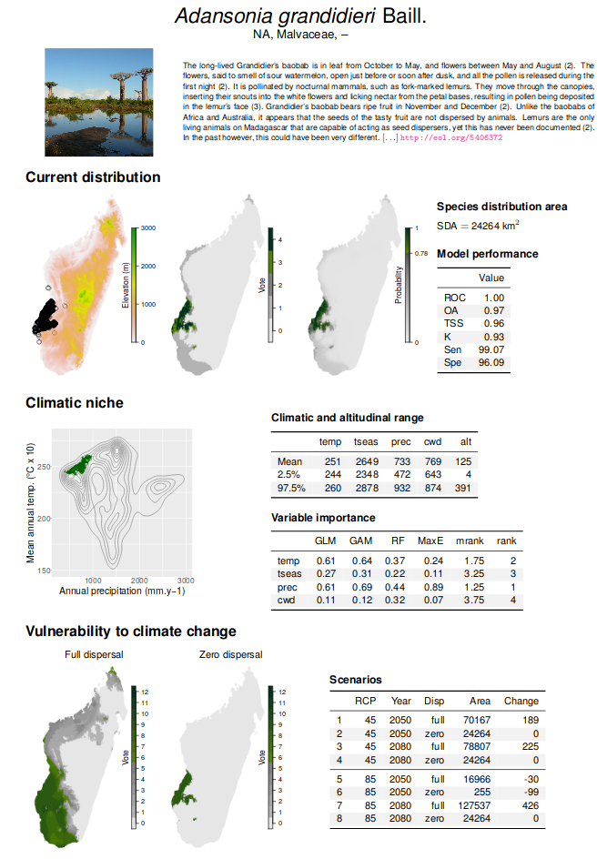
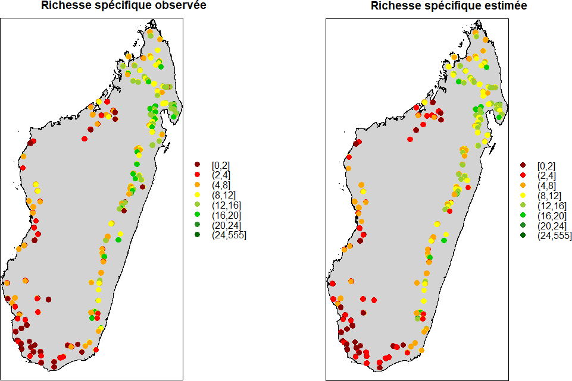
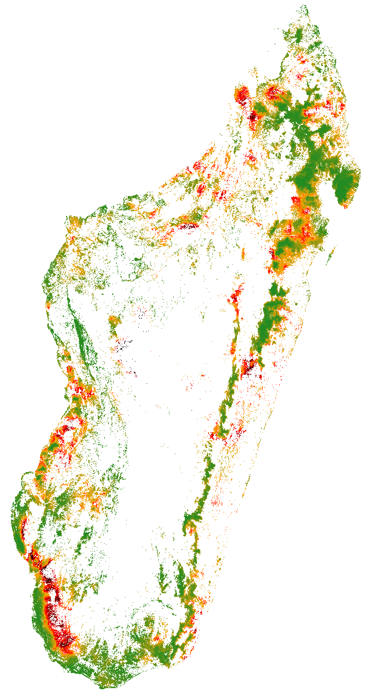

# 4. Rapport d'activités et productions scientifiques 

## _Description générale des activités et résultats_

```{r comment4, echo=FALSE}
# Décrivez le déroulement du projet, ses principaux résultats, et leur importance pour ce domaine de recherche en précisant la contribution de chacune des équipes participantes. Merci d'insérer quelques figures clés et de fournir les graphiques originaux séparément. Environ 8 à 10 pages.
```

### Contexte et enjeu

L'île de Madagascar s'est séparée du continent africain il y a environ 165 millions d'années, et de l'Inde il y a 88 millions d'années [@Ali2008]. Cette île continent a été colonisée par les humains il y a seulement 2300 ans environ [@Burney2004; @Cox2012; @Tofanelli2009]. La flore et la faune de Madagascar ont évolué de façon isolée. Ceci a contribué à l'émergence d'une biodiversité exceptionnelle à Madagascar et d'un fort taux d'endémisme dans de nombreux groupes taxonomiques [@Crottini2012; @Goodman2005]. Madagascar contient ainsi 5% de la biodiversité mondiale connue sur seulement 0,4% des terres émergées dans le monde. Il a quatre fois plus d'espèces de palmiers que dans toute l'Afrique [@Dransfield1995]. Un quart des espèces de plantes vasculaires existent à Madagascar pour un cinquantième de la superficie des terres par rapport à l'Afrique [@Schatz1996]. De même, plus de la moitié des espèces de caméléons du monde sont présentes à Madagascar. L'endémisme au niveau de la famille et du genre taxonomique est également élevé. Chez les amphibiens, 23 des 24 genres existants, et une famille sur quatre est endémique de Madagascar [@Vieites2009]. Plus de 83% des plantes vasculaires [@Schatz2000] et jusqu'à 86% des invertébrés sont endémiques de l'île [@Goodman2005]. A Madagascar la diversité phylogénétique des vertébrés est plus élevée que dans toute l'Amérique centrale et du Sud [@Holt2013]. La biodiversité terrestre de Madagascar est principalement concentrée dans les forêts tropicales de l'île [@Hannah2008] qui incluent plusieurs types de végétation ligneuse tels que les forêts humides de l'Est et du Nord, les forêts sèches épineuses du Sud et les forêts sèches décidues à l'Ouest [@Vieilledent2016].

La biodiversité malgache est sévèrement menacée par le changement climatique [@Hannah2008] et la déforestation [@Allnutt2008; @Harper2007; @Vieilledent2013]. Plusieurs études ont mis en évidence le risque de perte de biodiversité due au changement climatique à Madagascar. De nombreuses espèces malgaches, par exemple les reptiles, ont des niches climatiques étroites et sont particulièrement vulnérables. Dans une étude portant sur 30 espèces de reptiles et d'amphibiens dans le massif le plus élevé de Madagascar, @Raxworthy2008 ont montré un déplacement en altitude des espèces de 19 à 51 m entre 1993 et 2003 qui est associé au réchauffement climatique local. Le déplacement vers le haut de la pente peut potentiellement entraîner l'extinction des espèces actuellement présentes aux plus hautes altitudes. De plus, plusieurs auteurs ont prédit une perte d'habitat importante sous l'effet du changement climatique tant pour les espèces animales (voir @Andriamasimanana2013 pour le cas de neuf espèces d'oiseaux malgaches) que végétales [@Hannah2008; @Vieilledent2013a], et qui pourraient conduire à l'extinction des espèces (voir l'exemple de l'espèce de baobab _Adansonia suarezensis_ dans l'article de @Vieilledent2013a). Alors que la biodiversité terrestre de Madagascar est principalement concentrée dans les forêts, les études par télédétection et analyse d'images satellites révèlent que seulement 10 à 15% de la forêt originelle subsiste à Madagascar et que la déforestation se poursuit à un rythme d'environ 1% par an [@Achard2002; @Harper2007; @Vieilledent2013]. Pendant ce temps, la population humaine a plus que triplé depuis 1950 et continue de croître à un rythme proche de 3% par an [@Raftery2012; @Vieilledent2013]. À Madagascar, les moyens de subsistance des populations dépendent dans une large mesure des ressources forestières. Certaines études indiquent que le capital naturel du pays représente 49% de la richesse totale du pays [@WorldBank2013]. @Vieilledent2013 ont récemment souligné le lien entre démographie et intensité de la déforestation à Madagascar et le risque d'une augmentation de la vitesse de la déforestation à court terme liée à l'explosion démographique. De plus, plusieurs indices de développement placent couramment Madagascar autour du dixième rang des pays les plus pauvres, ce qui induit un risque fort de pression sur les forêts naturelles restantes. En raison à la fois des niveaux élevés de diversité et d'endémisme sur l'île et du déclin rapide des habitats naturels, Madagascar est universellement reconnue comme une priorité mondiale pour la conservation de la biodiversité [@Brooks2006; @Myers2000].

Pour éviter la déforestation et atténuer les changements climatiques, Madagascar est en train de mettre en place le programme national REDD+ de Réduction des Emissions liées à la Déforestation et à la Dégradation des forêts. Plusieurs projets pilotes REDD+ ont été développés à Madagascar, principalement dans la forêt tropicale humide de la côte Est (voir par exemple le PHCF, "Programme Holistique de Conservation des Forêts", présenté dans @Vieilledent2013). Bien que le programme REDD+ soit principalement axé sur les émissions de carbone, le programme REDD+ national et les projets locaux devront intégrer des co-bénéfices pour la biodiversité. Pour le moment, peu d'information et d'outils sont disponibles pour évaluer l'impact des projets REDD+ en terme de conservation de la biodiversité.

Pour préserver la biodiversité malgache, un travail remarquable a été réalisé depuis le cinquième congrès mondial sur les parcs de l'UICN (Union Internationale pour la Conservation de la Nature) tenu à Durban en 2003, afin de concevoir un réseau d'aires protégées intégrant les points chauds de biodiversité et les aires protégées existant à l'époque au niveau national [@Kremen2008]. Actuellement, il existe plus de 50 aires protégées à Madagascar divisées entre les réserves naturelles intégrales (catégorie I de l'UICN), les parcs nationaux (catégorie II de l'UICN) et les réserves spéciales (catégorie IV de l'UICN) [@Rabearivony2010]. Parmi ces aires protégées, beaucoup sont dans un statut temporaire ou en cours de création [@Rabearivony2010]. Le future réseau d'aires protégées à Madagascar (SAPM, Système d'Aires Protégées à Madagascar) devrait couvrir plus de 10% du territoire nationale et intégrer une bonne partie des forêts naturelles subsistant à Madagascar. Dans le contexte d'un changement climatique anthropique rapide [@IPCC2014; @Loarie2009], il est très probable que de nombreuses espèces ne soient pas en mesure de s'adapter ni de coloniser de nouveaux habitats favorables d'un point de vue climatique [@Menendez2006]. Ceci s'explique en partie par une faible dispersion des espèces, rendue difficile par la disparition des animaux disperseurs [@Menendez2006; @Vieilledent2013a] et une perte d'habitat (associé à la déforestation) en dehors des aires protégées actuelles [@Vieilledent2013a]. Ainsi, les espèces devraient connaître une contraction de leur aire de distribution actuelle [@Andriamasimanana2013; @Hannah2008; @Raxworthy2008; @Vieilledent2013a]. Par conséquence, la majeure partie de la biodiversité devrait se concentrer dans des zones refuge à l'intérieur des aires protégées. Identifier ces zones refuge est particulièrement important afin d'orienter les efforts de conservation sur des sites pertinents.

### Objectifs

L'objectif du projet BioSceneMada est de développer des scénarios d'évolution de la biodiversité sous l'effet conjoint de la déforestation et du changement climatique (Fig. \@ref(fig:schema)). On se propose premièrement d'établir des scénarios de déforestation et d'estimer la perte de biodiversité associée à cette déforestation. Les scénarios de déforestation s'appuieront sur les taux de déforestation historiques, qui seront à estimer, ainsi que sur la croissance démographique et sur le lien qui existe potentiellement entre population et déforestation. Ce lien sera à mettre en évidence et à estimer quantitativement. Les scénarios de croissance démographique ne seront pas à établir mais seront issus de la littérature. Deuxièmement, l'objectif est d'estimer l'impact des changements climatiques sur la perte de biodiversité à Madagascar. Il faudra donc dans un premier temps établir une base de données représentative de la biodiversité à Madagascar. L'impact sur la biodiversité sera considéré sous l'angle des espèces (risque d'extinction des espèces via la contraction des aires de distribution, ex. les espèces de baobabs) mais également sous l'angle des communautés (perte d'habitat ou restriction des habitats pour les communautés, ex. la forêt tropicales humides de montagne). Les scénarios climatiques du GIECC (Groupe International d'Experts sur les Changements Climatiques) seront utilisés. Troisièmement, l'objectif du projet est d'identifier les futurs points-chauds ("hotspots") de biodiversité à fort risque de déforestation.

L'ensemble de ces scénarios sera spatialisé et les résultats seront principalement rendus sous forme de cartes. Les scénarios permettront notamment de proposer des stratégies d'aménagement du territoire les plus efficaces possibles en vue de la conservation de la biodiversité et s'appuyant sur des résultats issus de la recherche scientifique. Par exemple, les efforts de conservation pourraient être concentrés soit sur les zones refuges de la biodiversité sous contrainte climatique, soit au contraire sur des zones importantes pour la conservation de la biodiversité mais qui risquent de disparaître à cause de la déforestation.

(ref:cap-schema) **Description schématique du projet.** Les modèles combinent des données d'inventaires, des données environnementales et des données démographiques pour évaluer l'impact future des changements climatiques et de la déforestation sur la biodiversité à Madagascar. Les résultats sont utilisés pour une aide à la décision en aménagement du territoire et pour définir des stratégies de conservation efficaces.

```{r schema, out.width="\\textwidth", fig.cap="(ref:cap-schema)"}
knitr::include_graphics("figures/Scheme.png")
```

### Développement de modèles et scénarios de la biodiversité

#### Modélisation de l'intensité de la déforestation

Dans le prolongement des travaux de @Barnes1990, nous avons modélisé l'intensité de la déforestation ($D_{ij}$, en ha.an$^{-1}$) en fonction du couvert forestier existant ($F_i$, en ha) et de la taille de la population ($P_i$, nombre d'habitants). Le modèle intègre un effet aléatoire pays $b_j$ permettant de différencier le taux de déforestation moyen d'un pays à l'autre (Eq. \@ref(eq:intensity)). Afin d'estimer les paramètres de ce modèle, nous avons considéré les données pour l'ensemble des pays africains, y compris Madagascar. Les données de déforestation portent sur les périodes 1990-2000 et 2000-2010. Elles proviennent de différents instituts: le Global Forest Watch [@Hansen2013], le Centre Commun de Recherche de la Commission Européenne [@Achard2014] et la Food and Agriculture Organization [@FAO2015]. Les données de population proviennent des Nations Unies [@UN2015].

\begin{equation}
\begin{split}
\log(D_{ij})=\beta_0+b_j+\beta_1\log(F_i)+\beta_2\log(P_i)+\varepsilon_i \\
b_j \sim \mathcal{N}ormal(0,V_b) \\
\varepsilon_i \sim \mathcal{N}ormal(0,\sigma^2)
\end{split}
(\#eq:intensity)
\end{equation}

Quelque soit le jeu de données considéré, nous avons estimé un effet significatif du couvert forestier (plus la ressource forestière est importante, plus les surfaces déforestées le sont) et de la population (plus la population est élevée, plus les surfaces déforestées le sont). L'équation \@ref(eq:intensity2) indique les valeurs des paramètres pour le modèle utilisant les données de @Achard2014. Les deux facteurs agissent de façon opposée avec le temps: la surface forestière tend à diminuer alors que la population tend à augmenter dans le future.

\begin{equation}
\log(D_i)=-10.284+0.568\log(F_i)+0.534\log(P_i)
(\#eq:intensity2)
\end{equation}

Des scénarios d'évolution des surfaces déforestées dans le future, et de la perte de biodiversité associée, peuvent ainsi être établis par pays en prenant en compte les prévisions démographiques des Nations Unies [@UN2015].

#### Modélisation spatialisée de la déforestation

Afin d'identifier les zones à risque de déforestation, nous avons modélisé (Eq. \@ref(eq:proba)) la probabilité spatiale de déforestation ($\theta_{ij}$) en fonction de variables environnementales ($X_i$) décrivant l'accessibilité de la forêt (distance aux routes, villages et rivières, distance à la lisière de la forêt, topographie), son statut de protection (appartenance au réseau d'aires naturelles protégées) et son historique (distance à la déforestation passée). Ces variables, même si elles ont un effet qui est la plupart du temps significatif d'un point de vue statistique, expliquent une faible part de la déforestation. Ainsi, le modèle que nous avons utilisé intègre également des effets aléatoires spatiaux auto-corrélés ($\rho_j$) qui permettent de prendre en compte la variabilité spatiale résiduelle, non-expliquée par les facteurs environnementaux, et de l'estimer. 

\begin{equation}
\begin{split}
D_{ij} \sim \mathcal{B}ernoulli(\theta_{ij}) \\
\text{logit}(\theta_{ij})=X_i\beta+\rho_j \\
\rho_j \sim \mathcal{N}ormal(\mu_j,V_{\rho} / n_j)
\end{split}
(\#eq:proba)
\end{equation}

Ce type de modèle, intégrant la variabilité régionale, permet de produire des cartes de probabilité de déforestation à une date donnée qui sont plus réalistes. La carte de probabilité de déforestation permet d'identifier les zones à fort risque de déforestation et d'obtenir des cartes de couvert forestier future en fonction de différents scénarios d'intensité de déforestation (avec croissance démographique, "business-as-usual" ou avec atténuation).

#### Modélisation de la niche climatique des espèces

Nous avons utilisé des modèles de distribution des espèces afin d'identifier la niche climatique des espèces et de prédire leur vulnérabilité au changement climatique. Cette approche s'appuie sur des modèles d'ensemble et sur les données de présence ($P_i$) des espèces. Plusieurs algorithmes statistiques sont utilisés pour estimer la niche climatique des espèces et les prédictions des modèles sont moyennées. Nous avons choisi quatre algorithmes selon un gradient de robustesse et de complexité: les modèles GLM (Generalized Linear Model), les modèles GAM (Generalized Additive Models), les modèles de classification par forêt aléatoire RandomForest et l'approche par maximum d'entropie MaxEnt. Tous ces modèles permettent d'estimer une probabilité de présence de l'espèce ($\delta_i$) en fonction de variables climatiques (Eq. \@ref(eq:SDM)).

\begin{equation}
\begin{split}
P_i \sim \mathcal{B}ernoulli(\delta_i) \\
\text{logit}(\delta_{i})=f(X_i)
\end{split}
(\#eq:SDM)
\end{equation}

En utilisant les scénarios et modèles climatiques du GIECC [-@IPCC2014], il est possible de prédire la probabilité de présence et l'aire de distribution future probable de chacune des espèces. Pour Madagascar, nous avons considéré les scénarios climatiques correspondant au RCP (Representative Concentration Pathway) 8.5 et au RCP 4.5 qui correspondent respectivement à un scénario pessimiste de croissance des émissions et à un scénario d'atténuation modérée des émissions de CO$_2$ sur le long terme. Concernant les modèles climatiques, trois modèles principaux, représentatif de la gamme des prédictions climatiques à Madagascar, seront sélectionnés: CCSM4 (modifications climatiques relativement faibles), GISS-E2-R (modifications climatiques moyennes) et HadGEM2-ES (modifications climatiques fortes).

#### Modélisation de l'assemblage des espèces en communauté

Nous avons cherché à identifier les facteurs environnementaux déterminants les assemblages d'espèces (biodiversité $\beta$) en utilisant des modèles de communauté. Les modèles de communautés que nous avons utilisés, appelés GDM (Generalized Dissimilarity Models), modélisent les changements d'espèces au sein de la communauté en fonction des gradients environnementaux en s'appuyant sur des indices de dissimilarités entre sites \citep{Ferrier2007}. Plus précisément, les GDM utilisent des GLM (Generalized Linear Models) pour modéliser des indices de Bray-Curtis observés $d_{ij}$ entre des paires de sites $i$ et $j$ en fonction de $n$ variables environnementales, de $x_1$ à $x_n$, via une fonction de lien exponentielle (Eq. \@ref(eq:GDM)). L'indice de dissimilarité $d_{ij}$ est exprimé en fonction du nombre $A$ d'espèces communes aux sites $i$ et $j$, du nombre $B$ d'espèces présentes uniquement au site $i$ et du nombre $C$ d'espèces présentes uniquement au site $j$ (Eq. \@ref(eq:GDM)).

\begin{equation}
    \text{ln}(1-d_{ij})=a_0 + \sum_{p=1}^{n} |f_p(x_{pi})-f_p(x_{pj})|
    d_{ij}=1-2A/(2A+B+C)
  (\#eq:GDM)
\end{equation}

En appliquant ce modèle à nos données de présence d'espèces à Madagascar, nous avons obtenu une première carte de la biodiversité $\beta$ à Madagascar. Les GDM peuvent être utilisés pour prédire les communautés les plus affectées par le changement climatique en se basant sur les scénarios climatiques du GIECC [-@IPCC2014].

### Principaux résultats

#### MadaClim: portail de données climatiques et environnementales à Madagascar

Dans le cadre du projet BioSceneMada, nous avons développé le site internet MadaClim (<https://madaclim.cirad.fr>). Ce site reprend toutes les données climatiques actuelles fournies par WorldClim ainsi que les prédictions climatiques issues des modèles du GIEC (groupe d'experts intergouvernemental sur l'évolution du climat) et fournies par le CGIAR CCAFS. Les données sont recompilées (reprojetées et rééchantillonnées à 1km) et distribuées spécifiquement pour Madagascar. Des variables bioclimatiques supplémentaires comme l'évapotranspiration et le nombre de mois secs ont été calculées et ajoutées aux variables déjà disponibles. En plus des données climatiques, des données environnementales (sol, géologie, altitude, etc.) sont également fournies. Ce site et ces données sont particulièrement utiles pour tous les chercheurs, gestionnaires, membres d'ONG environnementales, ministères voulant étudier les effets du changement climatique à Madagascar. Elles peuvent être utilisées par exemple pour calculer les anomalies climatiques prédites par les modèles du GIECC (Fig. \@ref(fig:anomalies)).

(ref:cap-pet) **Exemple de variable bioclimatique calculée: evapotranspiration potentielle (ETP) mensuelle actuelle pour Madagascar (mm).** Nous avons utilisé l'équation de Thornthwaite qui permet de calculer l'ETP à partir des températures moyennes mensuelles et de la durée moyenne du jour sur le mois.

```{r pet, out.width="80%", fig.cap="(ref:cap-pet)"}
# 
```

(ref:cap-anomalies) **Anomalies climatiques prédites sur les forêts de Madagascar entre 2010 et 2080.** Les anomalies ont été calculées pour les précipitations annuelles (panneau de gauche), la saisonnalité de la température (milieu) et la température moyenne annuelle (droite) en faisant la moyenne des prédictions de sept modèles climatiques du GIEC suivant le scénario d'émission RCP 8.5. Les précipitations devraient diminuer, notamment sur les forêts humides de l'est et la saisonnalité de la température ainsi que la température moyenne annuelle devraient augmenter sur l'ensemble des forêts de Madagascar.

```{r anomalies, out.width="\\textwidth", fig.cap="(ref:cap-anomalies)"}

```

#### Carte de carbone forestier et vulnérabilité des forêts tropicales au changement climatique à Madagascar
    
Dans le cadre du projet BioSceneMada, en utilisant les données climatiques précédemment calculées (<https://madaclim.cirad.fr>) et des données d'inventaires forestiers pour 1771 placettes réparties sur l'ensemble de Madagascar, nous avons démontré qu'il existait un lien fort entre climat et stocks de carbone forestiers. Ce lien est notamment déterminé par les caractéristiques architecturales (hauteur notamment) des espèces d'arbres présentes le long du gradient climatique à Madagascar (climat $\rightarrow$ assemblage d'espèces $\rightarrow$ stocks de carbone). Ainsi, les stocks de carbone sont en moyenne beaucoup plus faibles en forêt épineuse (17 Mg.ha$^{-1}$) qu'en forêt humide (150 Mg.ha$^{-1}$). Le modèle statistique intégrant la relation climat-stock de carbone a permis de produire une carte précise des stocks de carbone forestier à Madagascar à une résolution de 250 m. Cette carte pourra être utilisée par les instances gouvernementales à Madagascar ou les porteurs de projet REDD+ au niveau régional pour le calcul des émissions de CO2 associées à la déforestation. Cette carte ainsi que les données qui ont permis de l'obtenir sont disponibles sur le site du projet BioSceneMada (<https://bioscenemada.cirad.fr/carbonmaps>) ainsi que sur le serveur de données Dryad (doi: [10.5061/dryad.9ph68](http://doi.org/10.5061/dryad.9ph68)).

Concernant les scénarios d'évolution de la biodiversité et des stocks de carbone forestier, nous avons montré à l'aide de ce modèle que les changements climatiques devraient induire des modifications fortes des communautés forestières et en conséquence une diminution de -17% (7-24%) des stocks de carbone forestier à Madagascar à l'horizon 2100 par rapport à 2010 (Fig. \@ref(fig:carbonmaps)). Ces changements seront vraisemblablement plus forts pour la forêt humide de l'est (notamment autour de la péninsule de Masoala-Makira) que pour les forêts sèches et épineuses de l'ouest et du sud. En comparaison, un taux de déforestation constant de 0.5% par an conduirait à une perte de carbone forestier de l'ordre de 29% entre 2010 et 2100. L'impact potentiel des changements climatiques sur les émissions de CO2 n'est donc pas à négliger.

(ref:cap-carbonmaps) **Carte de carbone forestier et évolution potentielle des stocks sous l'effet du changement climatique.** Les changements climatiques devraient induire des modifications fortes des communautés forestières et en conséquence une diminution des stocks de carbone forestier (-17% en 2100 par rapport à 2010).

```{r carbonmaps, out.width="\\textwidth", fig.cap="(ref:cap-carbonmaps)"}
knitr::include_graphics("figures/carbonmaps.png")
```

#### Base de données de biodiversité à Madagascar

Nous avons construit un jeu de données sur la biodiversité à Madagascar regroupant 300 000 observations (points de présence) pour 4969 espèces. Ces espèces sont réparties dans différents groupes taxonomiques (Plantes, Vertébrés, Invertébrés) et sont représentatives de la biodiversité à Madagascar (Tab. \@ref(tab:species)). Nous avons apporté une attention particulière à la qualité des données. Toutes les données ont été vérifiées du point de vue des coordonnées géographiques (issues de relevés GPS) et de la taxonomie. Pour la vérification de la taxonomie, nous nous sommes appuyés sur le package `taxize` disponible sous le logiciel `R`. Ce travail de compilation de données de biodiversité est sans précédent à Madagascar. Les précédentes études scientifiques sur la biodiversité à l'échelle nationale à Madagascar s'appuyait sur un nombre d'espèces < 2843 [@Allnutt2008; @Kremen2008]. Plusieurs institutions ont accepté de partager leur données de biodiversité dans le cadre du projet BioSceneMada et ont ainsi largement contribué à la réalisation de cette base de données. Ces données sont souvent issues d'un travail de prospection conséquent qui s'étalent sur plusieurs dizaines d'années. Seule une partie de ces données brutes sont accessibles publiquement via la base de données ReBioMa maintenue par le WCS Madagascar (http://data.rebioma.net). Une discussion avec l'ensemble des institutions ayant fourni les données de biodiversité est en cours afin de voir dans quelle mesure celles-ci peuvent être rendues publiques.

(ref:cap-species) **Bases de données sur la biodiversité de Madagascar.** La base de données incluent des points de présence pour 4969 espèces réparties dans différents groupes taxonomiques. Ces espèces sont représentatives de la biodiversité à Madagascar.

```{r species, results="asis", echo=FALSE}
df.species <- read.table("tables/species.txt", header=TRUE, sep=";")
df.species <- df.species[,-c(1)]
names(df.species)[1] <- " "
vect.align <- c(rep("l",2), rep("r",3))
knitr::kable(df.species, caption="(ref:cap-species)", booktabs=TRUE, align=vect.align, linesep="") %>%
  kable_styling(latex_options=c("HOLD_position","striped"), full_width=FALSE, position="center") %>%
  group_rows("Plantes", 1, 6) %>%
  group_rows("Vertébrés", 7, 11) %>%
  group_rows("Invertébrés", 12, 15)
```

#### Atlas de la biodiversité à Madagascar et de sa vulnérabilité au changement climatique

Nous avons développé un package R nommé `speciesatlas` permettant de modéliser la niche climatique des espèces à partir de modèles d'ensemble [@Vieilledent2013a;@Araujo2007a]. A partir de variables environnementales, incluant des variables climatiques (température moyenne annuelle, saisonnalité de la température, précipitations annuelles, déficit en eau, nombre de mois secs) et des variables physiques (radiation solaire, géologie) disponibles sur le site [MadaClim](https://madaclim.cirad.fr), il permet de prédire la probabilité de présence ainsi que l'aire de distribution présente et future des espèces à Madagascar. Les prédictions sont issues de plusieurs modèles statistiques (Maxent, GLM, GAM et Random Forest). L'approche par modèles d'ensemble permet de moyenner les prédictions faites par plusieurs modèles statistiques afin d'évaluer l'incertitude des prédictions et d'augmenter la robustesse de l'aire de distribution. Le code initial a été développé au cours du stage de Master II de Mario Muniz-Tagliari et d'Aurélien Colas. L'idée est de pouvoir utiliser ce package afin de modéliser l'aire de distribution présente et de prédire la distribution future de l'ensemble des espèces constituant le jeu de données sur la biodiversité à Madagascar (4969 espèces). 

Le code est optimisé. Il peut être parallélisé, c'est-à-dire envoyé sur les différents processeurs d'un serveur afin d'accélérer les calculs. Il permet également de créer un document pdf dynamique, réactualisable très facilement, où les photos, textes, figures et tableaux sont agencés de manière automatique pour chaque espèce (Fig. \@ref(fig:atlas)). La dernière version du package est disponible sur GitHub: <https://github.com/ghislainv/speciesatlas>. L'objectif est d'obtenir au final un atlas de la biodiversité à Madagascar incluant (i) les points de présence des espèces, (ii) leur aire de distribution actuelle, (iii) la distribution future potentielle des espèces sous l'effet du changement climatique et une estimation de leur vulnérabilité au changement climatique.

Un prototype de cet atlas a été réalisé pour les 7 espèces de [Baobabs](https://bioscenemada.cirad.fr/FileTransfer/atlas.pdf) présentes à Madagascar et 55 espèces de [Lémuriens](https://etclab.org/atlas).

(ref:cap-atlas) **Extrait de l'atlas de la biodiversité à Madagascar et de sa vulnérabilité au changement climatique pour l'espèce _Adansonia grandidieri_.** Une fiche est dynamiquement créée à parti du nom taxonomique de l'espèce et de ses points de présence en utilisant un script `R`. Photo et texte sont extraits automatiquement du site _Encyclopedia Of Life_ (https://eol.org). Un ensemble de modèles statistiques est utilisé pour prédire la niche climatique et l'aire de distribution actuelle de l'espèce. Ce modèle d'ensemble est ensuite utilisé pour prédire la vulnérabilité de l'espèce au changement climatique en intégrant les prédictions climatiques du GIECC suivant deux scénarios, RCP 8.5 et 4.5.

```{r atlas, out.width="80%", fig.cap="(ref:cap-atlas)"}

```

\newpage
#### Impact du changement climatique sur les espèces de baobabs de Madagascar

Nous avons étudié l'impact du changement climatique sur les 7 espèces de baobabs présentes à Madagascar. Nous avons montré que trois espèces de baobabs connaîtront une forte contraction de leur aire de distribution ($>=-50\%$). Si la contraction de l'aire de distribution de l'espèce _A. rubrostipa_ s'explique par une augmentation du déficit hydrique, la contraction de l'aire de distribution des deux espèces _A. perrieri_ et _A. suarezensis_ s'explique par une augmentation de la saisonnalité de la température. L'espèce _Adansonia suarezensis_, par exemple, est adaptée à des zones de faible saisonnalité et une forte hausse de la saisonnalité est attendue au sein de son aire de distribution actuelle (Fig. \@ref(fig:cc-baobabs)a). L'espèce ne pourra pas migrer vers des zones à saisonnalité plus faible (vers l'équateur) en raison de l'océan qui agit comme une barrière géographique et verra ainsi son habitat disparaître (Fig. \@ref(fig:cc-baobabs)b). Dans les zones tropicales, il est prévu une augmentation générale de la saisonnalité (Fig. \@ref(fig:cc-baobabs)c). Il est fortement probable que de nombreuses espèces tropicales soient adaptées à une saisonnalité faible. L'équateur pourrait ainsi constituer une barrière climatique forte pour les espèces tropicales. Dans l'océan Indien et en Asie du Sud-Est, comme à Madagascar, les espèces pourraient ne pas pouvoir se déplacer vers l'équateur, l'océan agissant comme une barrière géographique.

(ref:cap-cc-baobabs) **Impact du changement climatique sur _Adansonia suarezensis_**. **a)** Augmentation de la saisonnalité de la température dans l'aire de distribution actuelle d'_A. suarezensis_. **b)** Contraction de l'aire de distribution d'_A. suarezensis_ et extinction de l'espèce sous l'effet du changement climatique (RCP 8.5, année 2085). **c)** Augmentation générale de la saisonnalité dans le future dans la zone intertropicale (RCP 8.5, année 2085).

```{r cc-baobabs, out.height="70%", fig.cap="(ref:cap-cc-baobabs)"}
knitr::include_graphics("figures/cc-baobabs.png")
```

#### Identification des zones de refuge climatique menacées de déforestation pour les espèces de lémuriens

Nous avons étudié l'impact du changement climatique et de la déforestation à Madagascar pour 55 des 111 espèces de lémuriens connues à Madagascar à l'aide du package `speciesatlas`. La base de données de présence inclut des informations pour 88 espèces de lémuriens mais seules 55 espèces avaient un nombre de données suffisant pour la modélisation de la niche climatique. Les résultats montrent que le changement climatique devrait diminuer l'habitat des lémuriens de plus de 60% en moyenne. En comparaison, la déforestation seule contribuerait à une diminution de 50% de l'habitat. Ces résultats signifient que si les lémuriens sont incapables de s'adapter au changement climatique, alors ce dernier sera plus néfaste pour eux que la déforestation. Par conséquent, il semble important de conserver en priorité les sites les plus climatiquement stables. Nous avons donc identifié ces zones de refuges climatiques et produit une carte à l'échelle de Madagascar (Fig. \@ref(fig:refuge-lemurs), gauche). Ces résultats ont été également analysés au regard du réseau d'aires protégées actuel. Il apparaît ainsi que plus de 55% des refuges climatiques sont à l'extérieur du réseau d'aires protégées (Fig. \@ref(fig:refuge-lemurs), gauche). Cela souligne la nécessité de développer davantage le réseau d'aires protégées actuel. De plus, 75% de ces refuges sont fortement menacés par la déforestation (Fig. \@ref(fig:refuge-lemurs), droite).

(ref:cap-refuge-lemurs) **Zones de refuge climatique menacées de déforestation pour 55 espèces de lémuriens**. Figure de gauche: en vert, les zones de refuge climatique pour 55 espèces de lémuriens en 2085 (RCP 8.5); en noir: le réseau d'aires protégées. Figure de droite: en rouge, les zones de refuge climatique en 2085 menacées de déforestation; en vert: les zones de refuge climatique à faible risque de déforestation.

```{r refuge-lemurs, out.height="50%", fig.cap="(ref:cap-refuge-lemurs)"}
knitr::include_graphics("figures/refuge-lemurs.png")
```

\newpage
#### Cartes de biodiversité et des communautés d'espèces à Madagascar

Lorsque l'on parle de carte de biodiversité à l'échelle nationale, l'objectif n'est pas uniquement d'obtenir des informations sur la localisation des "hotspots" ou points-chauds de la biodiversité (les sites ayant une diversité spécifique élevée), ce que l'on appelle la diversité $\alpha$. Il est en effet surtout intéressant de considérer la diversité $\beta$, c'est-à-dire les communautés ou assemblages d'espèces et comment les assemblages d'espèces changent spatialement ("species turnover"), selon des gradients environnementaux (d'altitude, de climat, etc.). De telles cartes n'existent pas actuellement à l'échelle nationale pour Madagascar. Seules des cartes de végétation sont disponibles pour lesquelles la classification s'appuie sur la définition de grands biomes (<http://www.vegmad.org>) et non sur des relevés à l'échelle de l'espèce, à la fois pour la faune et la flore.

En utilisant des modèles de communautés [@Ferrier2007], nous avons cherché à identifier les facteurs environnementaux déterminants les assemblages d'espèces. Ces facteurs peuvent être climatiques ou associés à des barrières géographiques comme les bassins versants ou les rivières [@Pearson2009]. Il ainsi été montré que la distribution des espèces de lémuriens à Madagascar était fortement liée aux bassins versants [@Wilme2006; @Mercier2013]. Les modèles de communautés que nous avons utilisés, appelés GDM (Generalized Dissimilarity Models), modélisent les changements d'espèces au sein de la communauté en fonction des gradients environnementaux en s'appuyant sur des indices de dissimilarités entre sites [@Ferrier2007]. En appliquant ce modèle à nos données de présence d'espèces à Madagascar, nous avons obtenu une première carte de la biodiversité $\beta$ à Madagascar (Fig. \@ref(fig:GDM)). Mais le pourcentage de déviance expliquée par ce modèle est faible (<10%).

(ref:cap-GDM) **Carte de biodiversité $\beta$ pour Madagascar.** Les couleurs indiquent les changements d'assemblage d'espèces spatialement: les sites aux couleurs proches présentent des assemblages d'espèces proches. Deux gradients sont largements visibles sur cette carte: un gradient est-ouest lié à la topographie (chaîne de montagne nord-sud) et aux précipitations ainsi qu'un un gradient nord-sud associé à la latitude et à la saisonnalité.

```{r GDM, out.width="40%", fig.cap="(ref:cap-GDM)"}
knitr::include_graphics("figures/GDM_map.png")
```

En appliquant ce même modèle à chaque groupe taxonomique, nous avons trouvé que (i) le pourcentage de variance expliquée par le modèle était généralement beaucoup plus élevé (entre 11% et 88%, Tab. \@ref(tab:gdms)) et que (ii) les facteurs explicants l'assemblage des communautés d'espèces varient d'un groupe taxonomique à l'autre, le climat n'étant pas toujours le facteur le plus important (Tab. \@ref(tab:gdms)). Par exemple, nous avons confirmé les résultats obtenus par @Wilme2006 pour les espèces de lémuriens. Pour ce groupe, ce sont les bassins versants qui expliquent en majorité l'assemblage des espèces (84% de déviance expliquée). Cela pourrait notamment s'expliquer par la difficulté qu'on les lémuriens à traverser les cours d'eau. A contrario, le climat explique une grande partie des assemblages d'espèces de reptiles et d'amphibiens, espèces poïkilothermes (animaux ayant une température corporelle qui varie avec celle de leur milieu) et des espèces de mammifères autres que les lémuriens. Pour d'autres groupes, comme les espèces d'arbres, les facteurs climatiques et les bassins versants semblent expliquer à part égale les assemblages d'espèces.

Ainsi, on voit qu'il est difficile d'établir une carte des communautés d'espèces végétales et animales à Madagascar, les facteurs explicatifs de la distribution des communautés changeant d'un groupe à l'autre. Nous montrons également que lorsque l'on utilise des modèles de communautés construits à partir de GDM, basés sur indices de dissimilarités combinant toutes les espèces, il y a un risque d'obtenir un modèle très peu explicatif, alors que des modèles à l'échelle du groupe taxonomique sont bien meilleurs. Il serait ainsi nécessaire d'envisager (i) de croiser les cartes de biodiversité obtenues par groupe taxonomique, ou bien (ii) de travailler plutôt avec des modèles de distribution à l'échelle de l'espèce, ou encore (iii) d'utiliser d'autres types de modèles comme les "modèles joints" [@Warton2015], permettant de combiner des processus à l'échelle de l'espèce et des processus à l'échelle de la communauté.

(ref:cap-gdms) **Facteurs expliquants l'assemblage des espèces par groupe taxonomique.** Le tableau indique le pourcentage de déviance expliquée par chacun des modèles. Les modèles Clim n'incluent que des variables climatiques, les modèles WS n'incluent que les bassins versants (WS pour "watershed") et les modèles C+WS incluent les deux types de facteurs. Le modèle Full inclut en plus des corrélations spatiales.

```{r gdms, results="asis", echo=FALSE}
df.gdms <- read.table("tables/gdms.txt", header=TRUE, sep=";")
names(df.gdms) <- c("","Clim","WS","C+WS","Full")
vect.align <- c("l",rep("r",4))
knitr::kable(df.gdms, caption="(ref:cap-gdms)", booktabs=TRUE, align=vect.align, linesep="") %>%
  kable_styling(latex_options=c("HOLD_position", "striped"), full_width=FALSE, position="center") %>%
  group_rows("Plantes", 1, 2) %>%
  group_rows("Animaux", 3, 8)
```

#### Cartes de biodiversité et des communautés d'espèces à Madagascar à l'aide du package `jSDM`

Depuis le lancement du projet BioSceneMada en 2014, de nouvelles approches statistiques ont vu le jour pour la modélisation des communautés d'espèces basées sur ce que l'on appelle les modèles joints de distribution des espèces (JSDM pour "Joint Species Distribution Models", @Warton2015). Ces modèles permettent de prédire la probabilité de présence des espèces dans un milieu donné en prenant en compte les variables environnementales (climat, sol, etc.) mais également les interactions entre espèces (co-occurrences par exemple). Peu de librairies logicielles permettent à ce jour d'estimer les paramètres de ce genre de modèle. Celles existantes (packages R `boral`, `HMSC` ou `gjam`) sont en phase de développement et ne sont pas forcément optimisées pour de gros jeux de données (temps de calcul long pour `boral` et `HMSC` qui font appel aux langages `jags` et R uniquement). Dans le cadre du projet BioSceneMada, nous avons décidé de développer un nouveau package R pour l'estimation de modèles joints de distribution des espèces que nous avons appelé  `jSDM` (<https://ecology.ghislainv.fr/jSDM/>). Ce package propose des fonctions faciles à utiliser qui appellent du code en C++ et permettent de réduire fortement les temps de calcul tout en gérant de gros jeux de données. Dans le cadre d'un stage de master II, nous avons utilisé les données d'inventaires pour les espèces d'arbres à Madagascar pour élaborer une nouvelle carte de biodiversité $\beta$ à l'aide de ce nouveau package R. Les inventaires regroupent des données de présence collectées entre 1994 et 1996 pour 555 espèces d'arbres sur 753 sites répartis sur l'ensemble de Madagascar. Nous avons pu obtenir des matrices d'interaction entre espèces, des cartes de richesse spécifique (Fig. \@ref(fig:jSDM-richness)) et de nouvelles cartes de biodiversité $\beta$, assez proches toutefois des cartes obtenues avec les modèles de type GDM ("Generalized Dissimilarity Models") indiquant les forts gradients nord-sud et est-ouest dans la détermination de la composition des communautés.

(ref:cap-jSDM-richness) **Comparaison de la richesse spécifique observée et prédite sur les sites d'inventaire.**

```{r jSDM-richness, out.width="100%", fig.cap="(ref:cap-jSDM-richness)"}

```

#### Soixante ans (1953-2014) d'étude de la déforestation et de la fragmentation forestière à Madagascar

Nous avons obtenu de nouvelles cartes d'évolution de la couverture forestière à Madagascar sur la période 2000-2014 (Fig. \@ref(fig:fcc)). Ces cartes sont sans nuages et disponibles à 30 m de résolution. Elles viennent compléter les cartes de @Harper2007 disponibles pour les années 1953, 1973 et 1990. Ainsi, nous avons pu étudier l'évolution du couvert forestier et de la fragmentation de la forêt à l'échelle nationale sur une période de 60 ans. Nous montrons que le couvert forestier a diminué de 44% sur la période 1953-2014 (37% si l'on considère la période 1973-2014). Les forêts naturelles couvrent 8.9 Mha en 2014 (15% du territoire national) et incluent 4.4 Mha (50%) de forêt humide, 2.6 Mha (29%) de forêt sèche, 1.7 Mha de forêt épineuse (19%) et environ 177,000 ha (2%) de mangrove. Depuis 2005, les surfaces déforestées annuellement ont augmenté à Madagascar pour atteindre 100,000 ha/an sur la période 2010-2014 (correspondant à un taux de déforestation de 1.1 %/an). Aujourd'hui, environ 50% de la forêt est située à moins de 100 m de la lisière et est donc exposée aux perturbations. Les cartes de couvert forestier sont disponibles sur le site du projet BioSceneMada: <https://bioscenemada.cirad.fr/forestmaps>. Elles servent de base au travail de modélisation du processus de déforestation.

(ref:cap-fcc) **Evolution du couvert forestier à Madagascar sur 60 ans de 1953 à 2014.** Les changements de couverture forestière de 1973 à 2014 sont présentés sur la figure principale. Le couvert forestier en 1953 est présenté dans l'encart en bas à droite. Deux séries de zooms sur la forêt sèche de l'ouest (à gauche) et de la forêt humide de l'est (à droite) présentent une vue plus détaillée de (du haut vers le bas): la couverture forestière en 1953, les changements de couverture forestière de 1973 à 2014, la fragmentation de la forêt en 2014 et la distance à la lisière de la forêt en 2014. Les données sur les plans d'eau et leur saisonnalité (bleu foncé pour permanent, bleu clair pour saisonnier) sont issues de l'article de [@Pekel2016].

```{r fcc, out.width="\\textwidth", fig.cap="(ref:cap-fcc)"}
knitr::include_graphics("figures/fig_fcc.png")
```

\newpage
#### Retour sur les facteurs de déforestation: la pauvreté n'est pas l'unique responsable de la déforestation à Madagascar. 

Afin de valider les cartes de déforestation historique obtenues sur la période 2000-2014 et d'identifier plus précisément les facteurs de déforestation, nous avons effectué une mission de terrain dans le Menabe, à l'ouest de Madagascar, en forêt sèche. Nous nous sommes concentrés sur deux zones identifiées comme "hot-spot" de déforestation, autour des Parcs Nationaux de Menabe-Antimena et Kirindy‐Mité. Nous avons effectué des observations de terrain ainsi que des enquêtes auprès des populations et de l'administration locale afin d'identifier les causes de la déforestation. Nous avons conclu que les causes directes de la déforestation dans la région sont l'agriculture sur brûlis pour la culture de rente comme le maïs ou l'arachide et le pâturage des zébus (Fig. \@ref(fig:causes)). Le maïs et l'arachide sont principalement exportés sur les marchés internationaux, notamment vers les îles de l'Océan Indien et en Chine. Ces activités sont favorisées par un marché global non régulé, une forte corruption et une non-application des lois environnementales à Madagascar. Dans l'hypothèse d'un scénario _"business-as-usual"_, si aucune solution n'est trouvée pour lutter efficacement contre la déforestation, le couvert forestier pourrait diminuer de plus de 50% sur la période 2010-2050 dans les deux zones d'étude.

(ref:cap-defor-Menabe) **Carte de déforestation et de projection de la déforestation autour du Parc National de Menabe-Antimena.** A gauche, la déforestation historique sur la période 2000-2010-2014. Vert: couvert forestier en 2014, orange: déforestation sur la période 2000-2010, rouge: déforestation sur la période 2010-2014. A droite, projection de la déforestation pour la période 2010-2050 selon deux scénarios d'intensité différents. Vert: couvert forestier en 2050, gris: déforestation sur la période 2010-2050.

```{r defor-Menabe, out.height="\\textwidth", fig.cap="(ref:cap-defor-Menabe)"}
# 
```

(ref:cap-causes) **Principales causes de la déforestation dans le Menabe centrale.** **a-a'**: Agriculture sur brûlis (_"hatsake"_) pour la culture d'arachide. **b-b'**: Agriculture sur brûlis pour la culture de maïs. **c-c'**: Cyclone suivi de feux incontrôlés d'origine anthropique. **d-d'**: Exploitation illégale de bois.

```{r causes, out.height="12cm", fig.cap="(ref:cap-causes)"}
knitr::include_graphics("figures/causes.jpg")
```

#### Logiciel Python `forestatrisk` pour le calcul de la probabilité spatiale de déforestation

Un module Python a été développé afin de pouvoir estimer rapidement la probabilité spatiale de déforestation sur de grandes échelles spatiales (nationales ou continentales) avec une résolution fine (ex. 30 ou 10 m) et de prédire quelles seront les zones à risques de déforestation et les zones potentielles de refuge de la biodiversité dans le futur. Le modèle portant sur la localisation de la déforestation permet de prédire la probabilité spatiale de déforestation en fonction de variables environnementales décrivant l'accessibilité de la forêt (distance aux routes, villages et rivières, distance à la lisière de la forêt, topographie), son statut de protection (appartenance au réseau d'aires naturelles protégées) et son historique (distance à la déforestation passée). Le module Python est disponible sur la plateforme GitHub: <https://github.com/ghislainv/forestatrisk>.

Nous avons utilisé ce module pour estimer la probabilité spatiale de déforestation à l'échelle nationale à Madagascar, à une résolution fine de 30 m et pour la couverture forestière de l'année 2010 (Fig. \@ref(fig:pred)). Cette démarche a fait l'objet d'un tutoriel où chacune des étape de modélisation est indiquée pas à pas. Cet tutoriel, disponible sous forme d'un notebook R est disponible à l'adresse suivante: <https://forestatrisk.cirad.fr/tutorial>. Le tutoriel pourra notamment être utilisé pendant les ateliers de renforcement de capacité dans les deux prochaines années à venir.

(ref:cap-pred) **Probabilité de déforestation pour les forêts de Madagascar.** Couvert forestier de l'année 2010 [@Vieilledent2018]. La probabilité de déforestation est faible (vert) dans les zones reculées et au sein des aires protégées et augmente (rouge puis noir) avec la proximité des villes et des routes.

```{r pred, fig.cap="(ref:cap-pred)"}

```

#### Cartes du couvert forestier future à Madagascar

A partir de la carte de probabilité de déforestation de 2010, en considérant une déforestation moyenne annuelle de 100 000 ha/an à l'échelle nationale sur la période 2010-2050, nous avons pu prédire les zones susceptibles d'être déforestées sur la période 2010-2050 et la couverture forestière probable à Madagascar en 2050 (Fig. \@ref(fig:fc2050)). Pour cela, nous calculons la surface forestière déforestée sur une période de 40 ans entre 2010 et 2050 (4 Mha) et nous attribuons la classe "non-forêt" aux pixels ayant la plus forte probabilité de déforestation jusqu'à obtenir une surface de 4 Mha. Les projections montrent une concentration des forêts dans les zones peu accessibles et situées en altitude dans le futur, notamment autour de la péninsule de Mosoala-Makira et dans le Corridor Ankeniheny-Zahamena (Fig. 8). Les aires protégées semblent relativement efficaces sur le court terme (horizon 2050) en contribuant à déplacer la déforestation sur des zones à plus faible biodiversité, en dehors des aires protégées. Par contre, si les taux de déforestation restent constants, la déforestation devrait pénétrer au sein des aires protégées les plus accessibles sur le plus long terme (horizon 2100).

(ref:cap-fc2050) **Deforestation sur la période 2010-2050 et couverture forestière en 2050 à Madagascar**. Nous projetons la couverture forestière à l'horizon 2050 en considérant une déforestation moyenne annuelle de 100 000 ha/an. Vert: forêt résiduelle en 2050; gris: déforestation sur la période 2010-2050.

```{r fc2050, out.width="\\textwidth", fig.cap="(ref:cap-fc2050)"}
knitr::include_graphics("figures/forest_cover_2050.png")
```

#### Modèles d'évolution de l'intensité de déforestation en Afrique et à Madagascar

Afin de proposer des scénarios d'évolution de l'intensité de déforestation et du couvert forestier à Madagascar, il a fallu construire un modèle à l'échelle de l'Afrique afin de disposer d'un plus grand nombre de données et d'avoir un modèle plus robuste. Le modèle permet d'estimer le taux de  déforestation (en ha/an) pour l'ensemble des pays africains en prenant en compte le couvert forestier existant (en ha) et la taille de la population (en nombre d'habitants). Trois jeux de données ont été comparés pour la modélisation : (i) celui issu du rapport Global Forest Resource Assessment (FRA) 2015 de la FAO [@FAO2015], (ii) celui issu du projet Trees du JRC [@Achard2014] et (iii) celui issu de Global Forest Watch [@Hansen2013]. Nous montrons que les données de déforestation du FRA ne peuvent pas être utilisées pour modéliser et prédire la déforestation ("outlier"). Les résultats permettent également de montrer que malgré les variations annuelles des taux de déforestation (associables aux marchés et aux politiques), la tendance sur le long terme est forte et qu'un simple modèle permet de reproduire fidèlement l'évolution du couvert forestier de 1990 à 2015 pour la plupart des pays africains. Ce modèle est utilisé pour prédire les tendances de déforestation pour les pays africains, selon un scénario de référence (ou scénario "business-as-usual"), en tenant compte des projections démographiques des Nations Unies jusqu'à l'horizon 2100. Pour Madagascar, on observerait une diminution de l'intensité de déforestation après 1950 liée à la transition démographique et à la réduction du couvert forestier disponible. Toutefois, les surfaces déforestées annuellement resteraient importantes (>75000 ha/an). Selon ce scénario, le couvert forestier diminuerait ainsi de plus de 50% entre 2000 et 2050 et de plus de 75% entre 2000 et 2100, pour atteindre environ 2 Mha en 2100 (Fig. \@ref(fig:intensity)). Ces scénarios d'évolution de l'intensité de déforestation intégrant la croissance démographique seront utilisés pour obtenir de nouvelles cartes du couvert forestier future en 2050 et 2100.

(ref:cap-intensity) **Evolution (1990-2010) et prédiction (2010-2100) de la déforestation et du couvert forestier à Madagascar.** La figure de gauche montre l'évolution de la déforestation (en milliers d'hectares par an) et la figure de droite l'évolution du couvert forestier (en milliers d'hectares). Nous avons considéré trois jeux de données (FAO FRA, Achard et al. 2014 JRC TREES project, Global Forest Watch Hansen et al. 2013). Les projections prennent en compte la croissance démographique (données des Nations Unies, 2015 Revision of World Population Prospects).

```{r intensity, out.width="\\textwidth", fig.cap="(ref:cap-intensity)"}
knitr::include_graphics("figures/deforMada.png")
```

\newpage
## _Liste des publications et communications scientifiques_

```{r comment5, echo=FALSE}
# Merci de lister dans la trame ci-dessous les publications et communications scientifiques liées à ce projet, y compris celles en préparation et sous presse. Pour les autres produits de diffusion des résultats, voir le point 4.
```

### I.1 - Articles ou communications primaires (résultats originaux) scientifiques
 
#### I.1.1. Dans périodique à comité de lecture.

##### _Articles acceptés_

**Grinand C., Vieilledent G., T. Razafimbelo, J.-R. Rakotoarijaona, M. Nourtier, and M. Bernoux.** Landscape‐scale spatial modelling of deforestation, land degradation and regeneration using machine learning tools. _Land Degradation and Development_. in press. https://doi.org/10.1002/ldr.3526.

**Vieilledent G., C. Grinand, F. A. Rakotomalala, R. Ranaivosoa, J.-R. Rakotoarijaona, T. F. Allnutt, and F. Achard.** 2018. Combining global tree cover loss data with historical national forest-cover maps to look at six decades of deforestation and forest fragmentation in Madagascar. _Biological Conservation_. 222: 189-197. https://doi.org/10.1016/j.biocon.2018.04.008.

**Ho Tong Minh D., E. Ndikumana, G. Vieilledent, D. McKey and N. Baghdadi.** 2018. Potential value of combining ALOS PALSAR and Landsat-derived tree cover data for forest biomass retrieval in Madagascar. _Remote Sensing of Environment_. 213: 206-214. https://doi.org/10.1016/j.rse.2018.04.056.

**Dezécache C., J.-M. Salles, G. Vieilledent, and B. Hérault.** 2017. Moving forward socio-economically focused models of deforestation. _Global Change Biology_. 23(9): 3484-3500. https://doi.org.10.1111/gcb.13611.

**El Hajj M., N. Baghdadi, I. Fayad, G. Vieilledent, J.-S. Bailly, and D. Ho Tong Minh.** 2017. Interest of integrating spaceborne LiDAR data to improve the estimation of biomass in high biomass forested areas. _Remote Sensing_. 9(3). https://doi.org/10.3390/rs9030213.

**Grinand C., G. Le Maire, G. Vieilledent, H. Razakamanarivo, T. Razafimbelo, and M. Bernoux.** 2017. Estimating temporal changes in soil carbon stocks at the ecoregional scale in Madagascar using remote-sensing. _International Journal of Applied Earth Observation and Geoinformation_. 54: 1-14. https://doi.org/10.1016/j.jag.2016.09.002.

**Vieilledent G., O. Gardi, C. Grinand, C. Burren, M. Andriamanjato, C. Camara, C. J. Gardner, L. Glass, A. Rasolohery, H. Rakoto Ratsimba, V. Gond, and J.-R. Rakotoarijaona.** 2016. Bioclimatic envelope models predict a decrease in tropical forest carbon stocks with climate change in Madagascar. _Journal of Ecology_. 104: 703-715. doi: https://doi.org/10.1111/1365-2745.12548.

Ces articles sont accessibles [ici](https://nextcloud.fraisedesbois.net/index.php/s/mcm5DLEXcztziRE) dans le dossier:   
`/Articles_scientifiques/Acceptes`.

##### _Articles en pre-print/review_

**Vancutsem Ch., F. Achard, J.-F. Pekel, G. Vieilledent, S. Carboni, D. Simonetti, J. Gallego.** Long-term monitoring of the tropical moist forests dynamics reveals unprecedented deforestation rates. in review.

**Muniz Tagliari M., P. Danthu, J.-M. Leong Pock Tsy, C. Cornu, J. Lenoir, V. Carvalho-Rocha, G. Vieilledent.** Not all species will migrate polewards as the climate warms: the case of the seven baobab species in Madagascar. pre-print.

**Vieilledent G., M. Nourtier, C. Grinand, M. Pedrono, A. Clausen, T. Rabetrano, J.-R. Rakotoarijaona, B. Rakotoarivelo, F. A. Rakotomalala, L. Rakotomalala, A. Razafimpahanana, J. M. Ralison, and F. Achard.** It's not only poverty: uncontrolled global trade and bad governance are responsible for unceasing deforestation in Western Madagascar. pre-print.

Ces articles sont accessibles [ici](https://nextcloud.fraisedesbois.net/index.php/s/mcm5DLEXcztziRE) dans le dossier:   
`/Articles_scientifiques/Preprint_inreview`.

##### _Articles en préparation_

**Vieilledent G., and F. Achard.** Including spatial-autocorrelation in deforestation model to obtain realistic deforestation projections at national or continental scales. in prep.
  
**Vieilledent G., W. F. Laurance, S. Peedell, and F. Achard.** The fate of tropical forests associated to the demographic explosion in Africa. in prep.

**Vieilledent G., Knoploch C., Colas A., C. Grinand** Madagascar biodiversity atlas: present species distribution and species vulnerability to climate change. in prep.

**Vieilledent G.** MadaClim: a set of climatic and environmental spatial variables for Madagascar. Data paper. in prep.

**Clément J., and G. Vieilledent.** jSM: an R package for Joint Species Distribution Modelling. in prep.

**Vieilledent G., Ch. Vancutsem and F. Achard.** High-resolution spatial modelling and long-term forecasting of anthropogenic deforestation in the tropics. in prep.

Ces articles sont en cours de rédaction. Ils intègrent des résultats qui peuvent être retrouvés dans les présentations orales effectuées lors de conférences (voir ci-dessous).

#### I.1.2. Dans périodique sans comité de lecture.

#### I.1.3. Rapports diplômants

**Clément J.** 2019. Développement d'un modèle joint de distribution des espèces pour la réalisation d'une carte de biodiversité à Madagascar. Rapport de Master. Sous la direction de G. Vieilledent. _Master II Mathématiques-Biostatistique_. Université de Montpellier. 43 p.

**Knoplock C.** 2019. The importance of deforestation and climate change in shaping lemurs' distributions and identifying their areas of climatic refuges. Rapport de Master. Sous la direction de C. Grinand et G. Vieilledent. _Master II Biodiversité, Ecologie et Evolution (BEE), finalité Gestion Adaptative de la Biodiversité (GABI)_. Université d'Aix Marseille. 43 p.

**Colas A.** 2018. Creation of a biodiversity atlas for Madagascar with the `speciesatlas` R package. Rapport de Master. Sous la direction de C. Grinand et G. Vieilledent. _Master I Bioinformatique et modélisation (BIM)_. INSA Lyon. 29 p.

**Grinand C.** 2016. Suivi et modélisation des changements d'usage des terres et stocks de carbone dans les sols et les arbres dans le cadre de la REDD+ à Madagascar. Vers des mesures pertinentes localement et cohérentes à large échelle. Manuscript de thèse. Sous la direction de M. Bernoux et G. Vieilledent. _Thèse de doctorat en Écologie Fonctionnelle et Sciences Agronomiques_. Montpellier SupAgro. Ecole doctorale GAIA. 245 p.

**Muniz Tagliari M.** 2015. Biogéographie et vulnérabilité au changement climatique des espèces de baobabs à Madagascar. Rapport de Master. Sous la direction de G. Vieilledent. _Master II Biologie Végétale Tropicale (BVT)_. Université de Montpellier. 47 p.

**Charra M.** 2015. Création d'une base de données et modélisation de la biodiversité à Madagascar. Rapport de Master. Sous la direction de G. Vieilledent. _Master II Ecologie, Biodiversité, Evolution (EBE), Préservation et Gestion Conservatoire des Ecosystèmes_. Université Paris-Saclay ENS, Université Paris Sud, AgroParisTech, Sorbonne Université, MNHN. 32 p.

**Long R.** 2014. Modélisation de la déforestation à Madagascar. Rapport de Master. Sous la direction de C. Grinand. _Master I Agronomie Générale_. AgroParisTech. 51 p.

Ces rapports sont disponibles [ici](https://nextcloud.fraisedesbois.net/index.php/s/mcm5DLEXcztziRE) dans le dossier:    
`/Rapports_diplomant_stages_theses`.

#### I.1.4. Communications courtes dans congrès / symposiums scientifiques 

**Vieilledent G.** 2019. Forest cover in Madagascar: Past, present and future (SYM/028). ATBC 2019: 56th annual meeting of the Association for Tropical Biology and Conservation. Antananarivo. Présentation orale.

**Vieilledent G., Ch. Vancutsem and F. Achard.** 2019. The fate of tropical forests: High resolution global maps of deforestation risk and future forest cover (GSOP/251). ATBC 2019: 56th annual meeting of the Association for Tropical Biology and Conservation. Antananarivo. Présentation orale.

**Knoploch C., C. Grinand, F. Montfort, G. Vieilledent**. 2019. A novel atlas representing Madagascar's biodiversity and potential refuges driven by deforestation and climate change (GSOP/158). ATBC 2019: 56th annual meeting of the Association for Tropical Biology and Conservation. Antananarivo. Présentation orale.

**Rakotomalala A. F., C. Grinand, L. Blanc, V. Gond, S. Rakotoniaina.** 2019. Using remote sensing techniques to monitor forest degradation and forest regeneration in Madagascar's tropical eastern rainforest (GSOP/117). ATBC 2019: 56th annual meeting of the Association for Tropical Biology and Conservation. Antananarivo. Présentation orale.

**Vieilledent G., J. Clement.** 2019. Using Rcpp* packages for easy and fast Gibbs sampling MCMC from within R. UseR!2019 conference. Toulouse. France. Présentation orale.

**Vieilledent G., and F. Achard.** 2018. Accounting for spatial autocorrelation in deforestation modelling. ISEC 2018: International Statistical Ecology Conference. St Andrews (UK). Présentation orale.

**Vieilledent G., W. F. Laurance, S. Peedell, and F. Achard.** 2016. The fate of tropical forests associated to the demographic explosion in Africa. Scennet 2016: international conference on Scenarios and Models of Biodiversity and Ecosystem Services in Support of Decision Making. Montpellier. Présentation orale.

**Grinand C., G. Vieilledent, T. Razafimbelo, J.-R. Rakotoarijaona, M. Nourtier M., and M. Bernoux.** 2016. New tools and methodological framework to study spatial drivers of deforestation, degradation and regeneration and forecast possible futures in Madagascar. Scennet 2016: international conference on Scenarios and Models of Biodiversity and Ecosystem Services in Support of Decision Making. Montpellier. Présentation orale.

**Vieilledent G., O. Gardi, C. Grinand, C. Burren, M. Andriamanjato, C. Camara, C. J. Gardner, L. Glass, A. Rasolohery, H. Rakoto Ratsimba, V. Gond, and J.-R. Rakotoarijaona.** 2016. Bioclimatic envelope models predict a decrease in tropical forest carbon stocks with climate change in Madagascar. In : Tropical ecology and society reconciliating conservation and sustainable use of biodiversity. Program and abstracts. Plinio Sist (ed.), Stéphanie Carrière (ed.), Pia Parolin (ed.), Pierre-Michel Forget (ed.). ATBC. Storrs : ATBC, Résumé, p. 325. Montpellier. Présentation orale. 

**Vieilledent G., M. Charra, M. Muniz-Tagliari, C. Grinand, T. F. Allnutt, D. Razafimpahanana, M. Pedrono, and J.-R. Rakotoarijaona.** 2015. Biodiversity Scenarios in Madagascar. ICCB-ECCB 2015: 27th International Congress for Conservation Biology - 4th European Congress for Conservation Biology conference. Montpellier. Poster.

**Vieilledent G., T. F. Allnutt, C. Grinand, M. Pedrono, J.-R. Rakotoarijaona, and D. Razafimpahanana.** BioSceneMada: Biodiversity scenarios under the effect of climate change and future deforestation in Madagascar. ICCB-ECCB 2015: 27th International Congress for Conservation Biology - 4th European Congress for Conservation Biology conference. Montpellier. Side-event FRB-FFEM. Présentation orale.

Ces présentations sont disponibles [ici](https://nextcloud.fraisedesbois.net/index.php/s/mcm5DLEXcztziRE) dans le dossier:    
`/Presentations_orales_conferences`.

#### I.1.5. Autres supports.

**Vieilledent G.** 2016. Les forêts tropicales, des "puits de carbone" hautement vulnérables. in [The Conversation](https://theconversation.com/les-forets-tropicales-des-puits-de-carbone-hautement-vulnerables-54281), J. Gallé (Associate Editor).

**Vieilledent G., C. Grinand, M. Pedrono, T. Rabetrano, J.-R. Rakotoarijaona, B. Rakotoarivelo, F. A. Rakotomalala and Dimby Razafimpahanana.** 2016. Deforestation process in the dry forests of the Menabe region, western Madagascar. Mission report.

Ces présentations sont disponibles [ici](https://nextcloud.fraisedesbois.net/index.php/s/mcm5DLEXcztziRE) dans le dossier:    
`/Autres_supports`.

```{r comment, eval=FALSE, include=FALSE}
# ### I.2 - Synthèses scientifiques 
#  
# I.2.1. Dans périodique à comité de lecture.    
# I.2.2. Dans périodique sans comité de lecture.    
# I.2.3. Chapitre d'ouvrage.    
# I.2.4. Ouvrage entier.    
# I.2.5. Rapports diplômants à caractère bibliographique (thèse vétérinaire...).    
# I.2.6. Conférences dans congrès ou symposium scientifique.    
# I.2.7. Autres supports.
```

## _Tableau des livrables_

```{r comment6, echo=FALSE}
# Tableau des livrables (tels qu'identifiés dans le projet soumis; avec livrables supplémentaires le cas échéant).
```

(ref:cap-livrables) **Livrables du projet BioSceneMada.** Les livrables sont classés par catégories ("Bases de données", "Cartes", etc.). Les articles, disposant d'une section spécifique dans le rapport, n'ont pas été repris.

```{r livrables, results="asis", echo=FALSE}
df.livrables <- read.table("tables/livrables.txt", header=TRUE, sep=";")
df.livrables <- df.livrables[,-c(1)]
col <- c("","Commentaire")
vect.align <- rep("l",2)
knitr::kable(df.livrables, caption="(ref:cap-livrables)", align=vect.align, col.names=col, booktabs=TRUE, linesep="") %>%
  group_rows("Bases de données",1,3) %>%
  group_rows("Scénarios",4,5) %>%
  group_rows("Cartes",6,11) %>%
  group_rows("Atlas",12,12) %>%
  group_rows("Logiciels",13,15) %>%
  kable_styling(latex_options=c("HOLD_position"), full_width=FALSE, position="center", font_size=11) %>%
  column_spec(1, width="8cm") %>%
  column_spec(2, width="7cm")
```

## _Personnes ayant participé à ce projet_

```{r comment7, echo=FALSE}
# Personnes ayant participé à ce projet: chercheurs et enseignants chercheurs, post-docs, doctorants, ingénieurs
```

(ref:cap-participants) **Liste des participants au projet par institution.** Le statut des personnes ayant participé au projet en temps que stagiaire de Master ou thésard est indiqué dans la colonne de droite.

```{r participants, results="asis", echo=FALSE}
df.participants <- read.table("tables/participants.txt", header=TRUE, sep=";")
col <- c("", "Statut particulier")
vect.align <- rep("l",2)
knitr::kable(df.participants, booktabs=TRUE, align=vect.align, col.names=col,
             caption="(ref:cap-participants)", linesep="") %>%
  pack_rows("ONE",1,3) %>%
  pack_rows("ETC Terra",4,10) %>%
  pack_rows("WCS",11,14) %>%
  pack_rows("Cirad",15,19) %>%
  kable_styling(latex_options=c("HOLD_position","striped"), full_width=FALSE, position="center")
```
