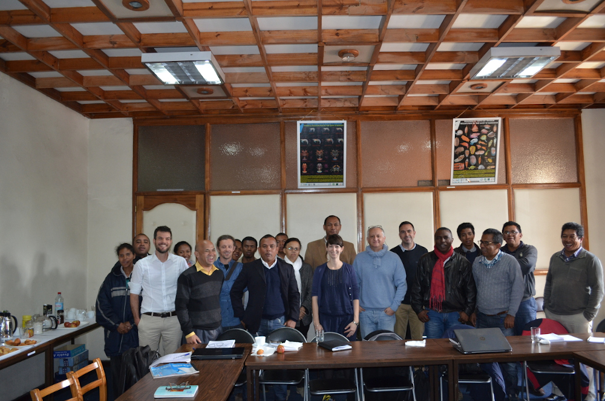
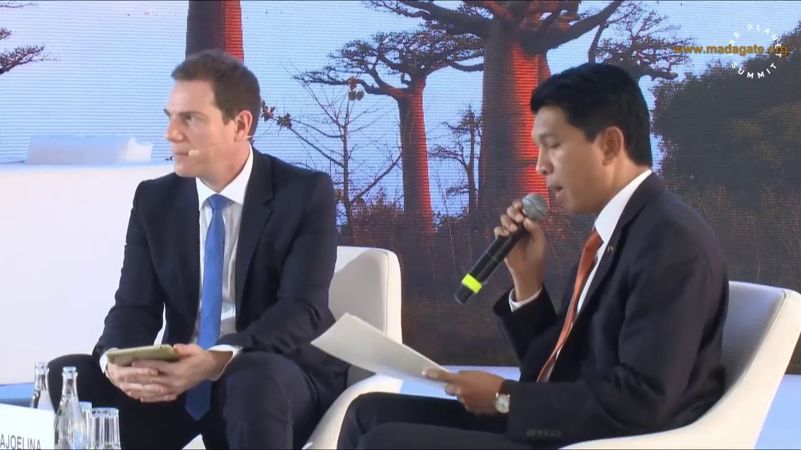
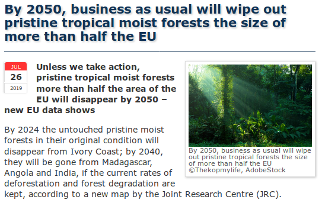

# 5. Autres actions, produits de diffusion et exploitation des résultats vers les décideurs et les acteurs concernés

```{r comment8, echo=FALSE}
# Les résultats des projets de recherche peuvent être diffusés et valorisés de différentes manière et par différents canaux: publications, colloques, posters ou synthèses scientifiques (cf section 3), mais également sites internet, synthèses à destination des décideurs, articles dans la presse, colloques vers des acteurs non académiques, systèmes d’aide à la décision, bases de données, etc. La FRB  encourage fortement la diffusion des résultats vers les décideurs et divers acteurs concernés.
```

## Diffusion, communication et transfert de connaissance (autres que supports à caractère scientifique)

```{r comment9, echo=FALSE}
# Décrivez les activités de diffusion et transfert de connaissances qui ont été mises en oeuvre en  direction de décideurs, gestionnaires, acteurs socio-économiques (ou autre porteurs d'enjeux), en lien avec ce projet. Merci d'indiquer publications, sites internet, présentations, articles de presse, interviews, projets éducatifs, etc. liés à ces recherches.
```

### Livre scolaire

Les éditions Hachette ont repris les résultats de l'article Vieilledent et al. 2018 [10.1016/j.biocon.2018.04.008](https://doi.org/10.1016/j.biocon.2018.04.008) dans le manuel scolaire de 1ère, spécialité sciences de la vie et de la terre (SVT), afin d'illustrer le chapitre 11.2 "L'Homme, perturbateur des écosystèmes" du thème 2 "Les enjeux contemporains de la planète" (p. 228):

**Bellamy J.-M., G. Camus, M. Chaize et al.** 2019. Planète SVT 1ère, Livre élève, Ed. 2019. Hachette édition. EAN 9782013954921. Code Hachette 7688616. 400 p.

L'extrait du manuel scolaire Hachette est disponible [ici](https://nextcloud.fraisedesbois.net/index.php/s/mcm5DLEXcztziRE) dans le dossier:    
`/Medias`.

### Sites internet

Plusieurs sites internet ont été créés dans le cadre du projet afin de permettre de partager les résultats et outils du projet:

- Site web BioSceneMada (https://bioscenemada.cirad.fr)! il permet d'avoir accès à toutes les informations et documents relatifs au déroulement du projet.
- Site web MadaClim (https://madaclim.cirad.fr): produit du projet BioSceneMada, il regroupe les données climatiques et environnementales pour Madagascar.
- Site web jSDM (https://ecology.ghislainv.fr/jSDM/): il présente le package R `jSDM` pour la modélisation jointe de la distribution des espèces et la réalisation de cartes de biodiversité.
- Site web ForestAtRisk (https://forestatrisk.cirad.fr): produit du projet BioSceneMada, il regroupe les outils et résultats associés à la modélisation et à la prévision de la déforestation.
- Page du projet BioSceneMada sur le [site web de la FRB](https://www.fondationbiodiversite.fr/la-frb-en-action/programmes-et-projets/modelisation-scenarios/bioscenemada/): elle présente succinctement les premiers résultats scientifique à l'issue de la première période de 3 ans.

### Supports de présentations grand public

**Vieilledent G., T. F. Allnutt, C. Grinand, M. Pedrono, J.-R. Rakotoarijaona, and A. Razafimpahanana.** BioSceneMada : Scénarios d'évolution de la biodiversité sous l'effet conjoint du changement climatique et de la déforestation à Madagascar. Plénière du Comité d'Orientation Stratégique de la FRB. 13 Décembre 2018, Paris, France.

**Lebastard A.M.** 2018. Fiche résultat du projet BioSceneMada. Programme "Modélisation et scénarios de la biodiversité". Projet 2013 (Afrique). https://www.fondationbiodiversite.fr/la-frb-en-action/programmes-et-projets/modelisation-scenarios/bioscenemada/

**Hallosserie A., J.-F. Silvain, P.-E. Guillain, C. Krug.** Présentation et résultats de projets soutenus par la FRB en lien avec les conclusions principales du rapport de l'IPBES. Encart sur le projet BioSceneMada. Rencontres scientifiques de l'AllEnvi "Transitions climatique, énergétique et écologique pour une planète durable". 4 juillet 2016, Paris, France.

**Vieilledent G., T. F. Allnutt, C. Grinand, M. Pedrono, J.-R. Rakotoarijaona, and A. Razafimpahanana.** BioSceneMada: biodiversity scenarios under the effect of climate change and future deforestation in Madagascar. Séminaire à Kew Royal Botanic Gardens, 21 juillet 2015, Londres, Royaume-Uni.

**Pedrono M., T. F. Allnutt, C. Grinand, J.-R. Rakotoarijaona, D. Razafimpahanana, and G. Vieilledent.** Séminaire du projet FED-FEDER POCT "Biodiversité de l'Océan Indien"", 2-5 juin 2015, Université de la Réunion, Saint Denis, Réunion, France. Public: Experts de la biodiversité de l'Océan Indien continental et étudiants en écologie de la Réunion.

**Vieilledent G., T. F. Allnutt, C. Grinand, M. Pedrono, J.-R. Rakotoarijaona, and D. Razafimpahanana.** 2015. BioSceneMada: Scénarios de la biodiversité sous l'effet conjoint du changement climatique et de la déforestation à Madagascar. Journées FRB 2015, "Les scénarios de la biodiversité à l'heure du changement climatique". 2 octobre 2015. Paris, France. Public: Experts français de l'IPBES et du GIECC.

**Pedrono M., T. F. Allnutt, C. Grinand, J.-R. Rakotoarijaona, D. Razafimpahanana, and G. Vieilledent.** Journée d'animation scientifique du Dispositif en Partenariat "Forêt et Biodiversité", 25 septembre 2015, FOFIFA-DRFP, Antananarivo, Madagascar. Public: Chercheurs et étudiants malgaches, membres de la direction du CIRAD.

**Pedrono M., T. F. Allnutt, C. Grinand, J.-R. Rakotoarijaona, D. Razafimpahanana, and G. Vieilledent.** Table ronde de la Journée du Volontariat Français sur le thème "Regards croisés sur le changement climatique à Madagascar", 3 octobre 2015, Alliance Française, Antananarivo, Madagascar. Public: Grand public malgache et français, volontaires internationaux français, ONGs de développement.

**Pedrono M., T. F. Allnutt, C. Grinand, J.-R. Rakotoarijaona, D. Razafimpahanana, and G. Vieilledent.** Série de conférences "COP21 à l'Institut Français de Madagascar: la recherche et le changement climatique", 25 novembre 2015, Alliance Française, Antananarivo, Madagascar. Public: Grand public malgache et français.

Pour les interventions s'appuyant sur des supports, ceux-ci sont disponibles [ici](https://nextcloud.fraisedesbois.net/index.php/s/mcm5DLEXcztziRE) dans le dossier:    
`/Presentations_grand_public`.

### Réunions avec les parties-prenantes

Plusieurs réunions de présentation du projet et de présentation des résultats intermédiaires ont eu lieu à Antananarivo avec les parties-prenantes du projet. Etaient présents des membres du MEEF (Ministère de l'Environnement, de l'Ecologie et des Forêts, Direction Générale des Forêts et Direction Générale de l'Environnement), des ONG environnementales (WWF, WCS, CI, GERP, Asity Madagascar, Vahatra, Biotope, Blue Ventures), des chercheurs (Université d'Antananarivo, ESSA, IOGA, LRI, IRD, Cirad, RGB Kew, MBG), des membres d'institutions nationales (Madagascar National Park, Office National de l'Environnement, FOFIFA):

- Réunion de lancement du projet, le 5 Mars 2014 à Antananarivo
- Réunion de présentation des avancées du projet, le 2 Avril 2015 à Antananarivo
- Réunion de présentation des avancées du projet, le 3 Juin 2016 à Antananarivo
- Réunion de fin de projet, le 29 Juillet 2019 à Antananarivo

(ref:cap-meeting) **Participants à la réunion de présentation des avancées du projet, le 3 Juin 2016 à Antananarivo.** Les participants incluent des chercheurs, étudiants, membres d'ONG environnementales ou institutions nationales.

```{r meeting, out.height="10cm", fig.cap="(ref:cap-meeting)"}

```

Deux autres ateliers de travail ont eu lieu avec les partenaires du projet à Montpellier:

- Atelier de travail, du 28 et 29 Avril 2016 à Montpellier
- Atelier de travail, du 27 Novembre au 01 Décembre 2017 à Montpellier

Le programme de ces différentes réunions et ateliers est disponible [ici](https://nextcloud.fraisedesbois.net/index.php/s/mcm5DLEXcztziRE) dans le dossier:    
`/Reunions`.

### Articles de presse

Les résultats de l'article sur la vulnérabilité des forêts tropicales au changement climatique à Madagascar (doi: [10.1016/j.biocon.2018.04.008](https://doi.org/10.1016/j.biocon.2018.04.008)) ont été largement diffusés dans la presse:
[Altmetric](https://www.altmetric.com/details/5051442)
[Journal of Ecology's blog](https://jecologyblog.wordpress.com/2016/05/06/editors-choice-1043/),
[The Conversation](https://t.co/pMXLUUrV0I),
[Le Figaro](https://ghislainv.github.io/images/media/Figaro-16-02-2016.png),
[Le Point](http://www.lepoint.fr/environnement/le-rechauffement-climatique-risque-d-empecher-les-forets-tropicales-de-stocker-le-carbone-12-02-2016-2017587_1927.php#xtor=RSS-221),
[FranceTV info](http://www.francetvinfo.fr/monde/environnement/le-rechauffement-climatique-risque-d-empecher-les-forets-tropicales-de-stocker-le-carbone_1312341.html#xtor=AL-54-%5Barticle%5D),
[El Mercurio](http://www.emol.com/noticias/Tecnologia/2016/02/12/788109/Estudio-asegura-que-cambio-climatico-amenaza-la-absorcion-de-CO2-por-bosques-tropicales.html),
[Midi-Libre](https://ghislainv.github.io//images/media/MidiLibre-16-02-2016.png),
[Cirad](http://www.cirad.fr/en/news/all-news-items/press-releases/2016/climate-change-alters-the-co2-storage-capacity-of-tropical-forests),
[Cirad activity report 2015](https://www.cirad.fr/content/download/11005/128917/version/3/file/RA2015_FR.pdf).

Les résultats de l'article sur la déforestation historique et la fragmentation des forêts à Madagascar (doi: [10.1002/ajb2.1175](https://doi.org/10.1002/ajb2.1175)) ont également été largement repris dans les médias:
[Altmetric](https://www.altmetric.com/details/38227025/news),
[Cirad press release](https://www.cirad.fr/en/news/all-news-items/press-releases/2018/deforestation-in-madagascar),
[Cirad news](https://www.cirad.fr/actualites/toutes-les-actualites/articles/2019/science/deforestation-a-madagascar-concilier-developpement-et-biodiversite),
[UPR Forêts et Sociétés news](https://ur-forets-societes.cirad.fr/actualites/le-president-malgache-cite-une-publication-du-cirad-pour-le-lancement-d-un-plan-de-conservation-et-de-restauration-des-forets).

### Interviews

Les résultats de l'article sur la vulnérabilité des forêts tropicales au changement climatique à Madagascar ont fait l'objet d'une interview sur Radio Classique dans l'émission "3 minutes pour la planète" du 16 Février 2016.

## Outils de gestion ou d'aide à la décision développés grâce à ce projet

Plusieurs outils ont été développés au cours du projet BioSceneMada pour la gestion ou l'aide à la décision concernant la conservation de la biodiversité à Madagascar. Ces outils sont sous forme de bases de données, de cartes à haute résolution, d'un atlas de la biodiversité, de logiciels. Ces outils seront notamment utiles pour l'application du programme REDD+ à Madagascar et l'optimisation du réseau d'aires naturelles protégées.

_Base de données_: Le projet BioSceneMada a permis de constituer une base de données climatiques et environnementales à Madagascar. Le projet a également permis d'obtenir une base de données de biodiversité incluant plus de 300 000 points de présences pour 4969 espèces représentatives de la biodiversité à Madagascar. Cette base de données, incluant des données privées, est intégrée à la base ReBioMa gérée par le WCS Madagascar. 

_Cartes_: Le projet BioSceneMada a permis d'obtenir différentes cartes utiles pour la gestion de la biodiversité. Sont disponibles: des cartes de couverts forestiers sur la période 1953-2017 à 30m de résolution, une première carte de la biodiversité $\beta$, une carte des habitats forestiers vulnérables/résilients aux changements climatiques, une carte de la couverture forestière probable en 2050 et 2100 indiquant les zones à risque de déforestation.

_Atlas_: Un atlas de la biodiversité est en cours de réalisation. Un prototype de cet atlas a déjà été réalisé pour les espèces de baobabs et de lémuriens à Madagascar. Cet atlas permettra d'obtenir l'aire de distribution actuelle des espèces ainsi qu'une estimation de leur vulnérabilité au changement climatique indiquant notamment les zones de refuge climatique pour ces espèces.

_Bibliothèques logicielles_: Trois principales bibliothèques logicielles à destination des gestionnaires ont été développées au cours du projet. Le module Python `forestatrisk` permet la modélisation et la projection spatialisée de la déforestation dans le futur suivant différents scénarios d'intensité. Le package R `speciesatlas` permet de modéliser la niche climatique des espèces et leur vulnérabilité au changement climatique en fonction des données de présence de l'espèce. Le package R `jSDM` permet la modélisation jointe de la distribution des espèces et la réalisation de carte de biodiversité $\beta$.

## Activités de suivi et valorisation des résultats

```{r comment10, echo=FALSE}
# Quelles activités sont prévues (ou pourraient être prévues) pour amplifier l'utilisation ou la mise en application des résultats ?
```

### Impact sur les politiques publiques

_Plan national de reforestation à Madagascar_

Le président malgache Andry Rajoelina a cité l'étude de Vieilledent et al. 2018 [10.1016/j.biocon.2018.04.008](https://doi.org/10.1016/j.biocon.2018.04.008) début 2019 dans une communication à son conseil des ministres  pour le lancement d'un plan national de reforestation et de conservation des forêts à Madagascar intitulé "Reverdir Madagascar". Il a officialisé le lancement de ce plan lors du One Planet Summit en mars 2019 à Nairobi (Fig. \@ref(fig:oneplanetsummit)). Ce plan consiste, entre autres, dans le reboisement de 40,000 ha de forêt par an et le déploiement de foyers à éthanol pour la cuisson des repas afin de limiter la consommation de bois énergie et la pression sur les forêts.

(ref:cap-oneplanetsummit) **Intervention du président malgache Andry Rajoelina lors One Planet Summit en mars 2019.** Le président reprend le chiffres de la déforestation publiés dans le cadre du projet BioSceneMada pour lancer son plan national de reforestation et de conservation des forêts à Madagascar.

```{r oneplanetsummit, out.width="0.7\\textwidth", fig.cap="(ref:cap-oneplanetsummit)"}

```

L'intégralité de l'intervention du président malgache au One Planet Summit ainsi que la communication au Conseil des Ministres malgache sont disponibles [ici](https://nextcloud.fraisedesbois.net/index.php/s/mcm5DLEXcztziRE) dans le dossier:    
`/Medias`.  

_Plan d'actions de l'Union Européenne sur la protection et la restauration des forêts_

La méthodologie pour le calcul et la projection des taux de déforestation mise au point dans le cadre du projet BioSceneMada a été réutilisée dans le cadre d'un travail en partenariat avec le JRC (Centre Commun de Recherche de la Commission Européenne). Ce travail portait sur l'ensemble des forêts tropicales humides du globe. A la suite de ce travail, la Commission Européenne à lancé un plan d'actions pour la protection et la restauration des forêts tropicales (Fig. \@ref(fig:EU)). Ce plan d'actions passe notamment par la suppression de la déforestation importée dans les chaînes de valeur telles que la filière soja, huile de palme, ou cacao par exemple.

(ref:cap-EU) **Lancement d'un plan d'action de l'Union Européenne pour la protection et la restauration des forêts.** L'ensemble du communité de presse est disponible sur le site de la Commission Européenne (https://ec.europa.eu/commission/presscorner/detail/en/IP_19_4470) ou bien [ici](https://nextcloud.fraisedesbois.net/index.php/s/mcm5DLEXcztziRE) dans le dossier `/Medias`. La carte présente les prédictions par pays de l'année de disparition des forêts tropicales intactes (n'ayant jamais subi de perturbations) sous un scénario de statu quo ("business-as-usual").

```{r EU, out.height="9cm", fig.cap="(ref:cap-EU)"}

```

### Renforcement de capacités

Sur 2018 et 2019, les deux dernières années du projet, nous avons organisé trois ateliers de renforcement de capacité à Madagascar. Ces ateliers étaient à destination des étudiants, chercheurs, techniciens et gestionnaires travaillant dans le domaine de la conservation de la biodiversité à Madagascar. Les ateliers de renforcement de capacité ont présentés les approches et outils développés au cours du projet BioSceneMada, à savoir: (i) les modèles et scénarios spatialisés de déforestation, et (ii) les modèles et scénarios d'évolution de la distribution des espèces:

- Atelier sur la modélisation de la déforestation, du 29 au 31 Octobre 2018 (3 jours), CeRSAE-FOFIFA à Antananarivo, ~20 participants.
- Atelier sur la modélisation de la déforestation, 23 et 24 Juillet 2019 (2 jours), Campus Numérique Francophone d'Ankatso à Antananarivo, ~30 participants.
- Atelier sur la modélisation de la distribution des espèces, 25 et 26 Juillet 2019 (2 jours), Campus Numérique Francophone d'Ankatso à Antananarivo, ~30 participants.

Les ateliers de renforcement de capacité sur les modèles et scénarios de déforestation ont eu pour objectif de former les participants à l'utilisation du module Python `forestatrisk`, servant à la spatialisation et la projection de la déforestation. Différents scénarios d'intensité de déforestation ont été explorés. Les cartes de couvert forestier futur produites par les participants pourront être utilisées pour l'établissement du scénario de référence concernant les émissions de CO~2~ associées à la déforestation à Madagascar. Ce scénario à l'échelle nationale est important pour la mise en place du programme REDD+ ("Réduction des Emissions liées à la Déforestation et la Dégradation des forêts") à Madagascar. Les membres du "Bureau National REDD+" ont participé à ces formations. L'objectif est que les participants puissent mettre à jour les scénarios de déforestation au fur et à mesure de l'actualisation des cartes historiques de déforestation ou des variables explicatives en entrée (développement du réseau routier par exemple). Un tutoriel pour l'utilisation du module `forestatrisk` a été préparé pour la formation et mise en ligne sur le site web ForestAtRisk: https://forestatrisk.cirad.fr/tutorial/.

L'atelier sur les modèles et scénarios d'évolution de la distribution des espèces ont eu pour objectif de former les participants à l'utilisation du package R `speciesatlas` permettant l'obtention de fiches synthétiques par espèce. Ces fiches présentent les résultats de la modélisation de la niche des espèces, des cartes de distribution et une estimation de la vulnérabilité des espèces au changement climatique. Ces fiches sont classées par groupe taxonomique et regroupées dans l'atlas de la biodiversité à Madagascar. L'objectif est que les participants puissent mettre à jour les fiches espèces et l'atlas au fur et à mesure de l'actualisation des données de présence ou bien complètent l'atlas par l'analyse de nouvelles espèces. Ces fiches peuvent être utilisées afin d'identifier les espèces présentes sur un territoire (une aire protégée par exemple) et estimer la vulnérabilité de ces espèces au changement climatique pour entreprendre d'éventuelles actions de conservation. Ces actions de conservation peuvent inclure des actions de protection accrue pour certaines zones refuges de la biodiversité ou des actions de restauration d'habitat. Ces résultats peuvent être utilisés par les gestionnaires d'aires protégées à Madagascar. Plusieurs gestionnaires d'aires protégées comme Madagascar National Park, Nitidae, WCS ou Asity Madagascar ont participé à cet atelier. L'ONE était également demandeur de ces outils afin de pouvoir obtenir des listes de présence d'espèces sur une zone donnée pour les études d'impact et les autorisations d'exploitation des ressources naturelles. Un tutoriel et des présentations pour l'utilisation du module `speciesatlas` ont été préparés pour la formation.

(ref:cap-formations) **Session de formation au Campus Numérique Francophone d'Ankatso à Antananarivo en Juillet 2019.** Deux sessions de formation ont eu lieu du Mardi 23 au Vendredi 26 Juillet 2019 et ont porté sur la modélisation spatialisée de la déforestation et la modélisation de l'aire de distribution des espèces. 

```{r formations, out.width="\\textwidth", fig.cap="(ref:cap-formations)"}
knitr::include_graphics("figures/formations")
```

La demande pour la participation à ce genre de formation est très forte à Madagascar. Le nombre de personnes inscrites aux différentes formations dépassait les capacités d'accueil et il a fallu sélectionner les participants. Les participants provenaient de nombreux instituts différents: institutions gouvernementales (MEDD), ONG environnementales (WRI, CI, WCS, Blueventures, MBG, WWF), Université d'Antananarivo (MBEV, IOGA, ESSA), instituts de recherche (Institut Pasteur, LRI), etc.

Le programme détaillé et le contenu des ateliers de renforcement de capacité, ainsi que la liste des participants, sont disponibles [ici](https://nextcloud.fraisedesbois.net/index.php/s/mcm5DLEXcztziRE) dans le dossier:    
`/Formations`.
